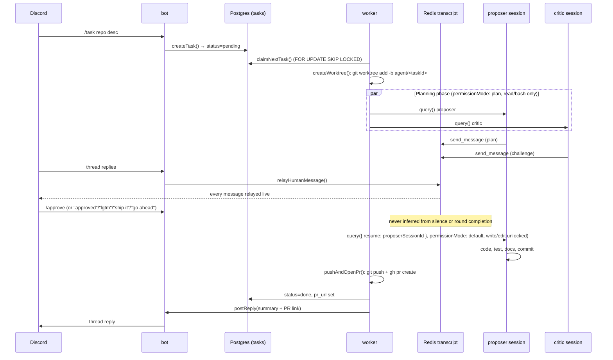
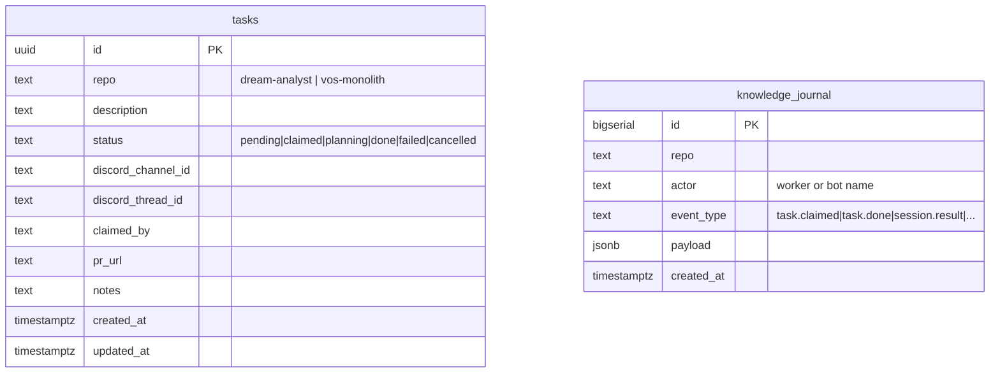

# ARCHITECTURE

Canonical topology and current features for `agent-fleet` — the WHAT. For
the WHY behind any specific choice, see [`DECISIONS.md`](DECISIONS.md) and
[`adr/`](adr/README.md). This file supersedes the old `mvp-spec.md`
(deleted) — where that spec described intent that the code later diverged
from, what's below reflects the actual implementation.

## 1. Components

| Component | Role |
|---|---|
| `bot/` | Discord ingress. Watches a trigger channel for `/task` (or legacy `!task repo: desc`), opens a thread, inserts a row into Postgres `tasks`, and relays every subsequent thread reply into that task's Redis planning transcript. |
| `worker/` | The Claude Code worker. One persistent pod per target repo. Polls `tasks` for its repo, creates a git worktree per claimed task, runs the planning phase then the implementation phase, opens a PR, replies in the Discord thread. |
| `mcp-redis/` | Stdio MCP server wrapping the shared Redis planning transcript as two tools (`send_message`, `wait_for_messages`) so proposer/critic Agent SDK sessions can read and write it. |
| `db/schema.sql` | Shared Postgres schema (`agentfleetdb`, Pigsty-managed): `tasks` queue + append-only `knowledge_journal`. |
| `k8s/` | Helm values for three deployed apps (`agent-fleet-bot`, `dream-analyst-worker`, `vos-monolith-worker`), consumed by two-source ArgoCD Applications defined in `infra-bootstrap`. |

## 2. End-to-end flow

`/stop` (or "stop"/"abort"/"cancel"/"kill" in a reply) aborts at any point
in either phase, not just at a checkpoint — relayed into the same Redis
transcript and checked first, before the word-match approval fallback.

## 3. Planning-phase guardrails

- **Critic is opt-out, human-only.** Critique runs by default; a
  `skip_critique` boolean on `/task` (default false) skips spawning the
  critic session entirely for that task — round-cap math then counts
  proposer turns alone. The proposer never decides this for itself — see
  [`adr/0011-critic-opt-out-and-context-handoff.md`](adr/0011-critic-opt-out-and-context-handoff.md).
- **Proposer→critic context handoff.** The proposer cites the files/paths
  it read in its plan message; the critic starts from those instead of
  re-reading the repo cold, only exploring further to verify a claim or
  cover a gap (same ADR).
- **Round cap:** every `MAX_PLANNING_ROUNDS` (default 1) proposer↔critic
  exchanges without a verdict from Mohammad, both sessions are aborted and
  a checkpoint posts to Discord: reply to continue, `/approve`, or `/stop`.
- **Session-end checkpoint:** if either session ends early (crash, turn
  limit, early return) before the round cap, the same checkpoint fires
  instead of silently retrying.
- **Turn/time limits are opt-in, not default.** `MAX_TURNS_PLANNING`,
  `MAX_TURNS_IMPLEMENTATION`, and `PLANNING_TIMEOUT_MS` are all unbounded
  unless explicitly set — fixed defaults were tried and repeatedly proved
  too tight for genuine exploration of an unfamiliar codebase (see
  `worker/src/planning.ts`'s inline comments and
  [`adr/0008-unbounded-guardrail-defaults.md`](adr/0008-unbounded-guardrail-defaults.md)).
- **No cost cap.** Claude Code authenticates via `CLAUDE_CODE_OAUTH_TOKEN`
  (subscription), not a metered API key, so `total_cost_usd` in SDK
  results is notional, not a real charge.
- Every SDK message (not just the final result) streams to `kubectl logs`
  and, for assistant text, to the Discord thread — added after a real
  incident where a missing `allowedTools` entry silently denied every
  MCP tool call with zero visible signal until cost/turn-count was
  inspected after the fact.

## 4. Current features (the golden path, working today)

- `/task`, `/approve`, `/stop` Discord slash commands, guild-scoped
  (registers instantly, no global-command propagation delay).
- Legacy fallback: free-text `!task <repo>: <description>` trigger and
  plain "approved"/"stop" replies, for anyone who doesn't use the slash
  commands.
- Live relay of every proposer/critic message — and their raw assistant
  reasoning text, not just formal `send_message` posts — to the Discord
  thread as it's generated.
- Explicit-approval gate: write/edit tools are structurally absent from
  the planning-phase `allowedTools` list, not just discouraged by prompt.
- Same proposer session resumed into implementation — no restart, no
  context loss between planning and coding.
- Git commit identity derived live from the authenticated bot GitHub
  account (`gh api user --jq .login`), not hardcoded — stays correct if
  the bot account changes.
- Append-only `knowledge_journal` (task claimed/cancelled/done/failed,
  session results) — a shared fleet-wide record, avoiding the
  write-conflict issues a mutable shared doc would hit across concurrent
  worker pods.

## 5. Deployment shape

One **persistent, always-on** worker pod per target repo
(`dream-analyst-worker`, `vos-monolith-worker`) — not one Kubernetes Job
per task. This superseded the original one-Job-per-task design on
2026-07-30; git-worktree-per-task isolation happens *inside* the
long-lived pod instead of at the pod-lifecycle level (see
[`adr/0003-persistent-worker-pod-per-repo.md`](adr/0003-persistent-worker-pod-per-repo.md)).
`replicaCount: 1`, always-on for now — KEDA scale-to-0 is not yet wired up.

Both worker apps and the bot mount a shared `ReadWriteMany` PVC
(`agent-fleet-shared-pvc`, owned by the bot's Application) at
`/mnt/fleet-shared`, alongside their own per-repo `ReadWriteOnce` workspace
PVC at `/workspace` for the git checkout + per-task worktrees.

### Deploy pipeline

1. Push a tag → `.github/workflows/docker.yml`'s `build-push` job builds
   both `worker` and `bot` images (matrix), pushes to Docker Hub, Trivy-scans
   each.
2. Its `deploy` job `sed`-bumps every `tag: "..."` in `k8s/*.yaml` to the
   pushed tag and commits straight to `main` (via the default
   `GITHUB_TOKEN`, deliberately not re-triggering `release.yml`'s
   push-to-main trigger).
3. ArgoCD's two-source Applications (chart from `infra-bootstrap`, values
   from this repo's `k8s/`) pick up the new pinned tag and sync.
4. `db/schema.sql` is applied idempotently via a `PreSync` hook on the
   bot's Application, reusing the bot's own image.

`release.yml` runs separately (`release-it`, conventional-changelog/angular
preset) on ordinary pushes to `main`, bumping `package.json`'s version and
`CHANGELOG.md` — unrelated to the image-tag bump above.

## 6. Data model

`tasks` is the mutable queue (`db/schema.sql`); `knowledge_journal` is
append-only, written by both `bot/` and `worker/` (`appendJournal()` in
each package's own `db.ts`) — no foreign key between them, joined only by
`repo`/timing when reading.

## 7. Environment variables

### `worker/`

| Var | Default | Notes |
|---|---|---|
| `TARGET_REPO`, `TARGET_REPO_URL` | *(required)* | Which repo this pod owns |
| `WORKER_NAME` | `<TARGET_REPO>-worker` | |
| `BASE_BRANCH` | `main` | e.g. `dev` for `vos-monolith`, whose `main` only gets prod tag bumps |
| `POLL_INTERVAL_MS` | `5000` | |
| `CLAUDE_MODEL` | `claude-opus-4-8` | |
| `MAX_PLANNING_ROUNDS` | `1` | |
| `MAX_TURNS_PLANNING`, `MAX_TURNS_IMPLEMENTATION` | unbounded | opt-in caps |
| `PLANNING_TIMEOUT_MS` | `0` (unbounded) | |
| `MCP_REDIS_ENTRY` | `/app/mcp-redis/src/index.ts` | |
| `REDIS_HOST`/`REDIS_PORT`/`REDIS_MAIN_PASSWORD` | `redis.bnei.lan`/`6379`/– | |
| `AGENTFLEET_DB_HOST`/`PORT`/`NAME`/`USER`/`PASSWORD` | `postgres.bnei.lan`/`5432`/`agentfleetdb`/`dbuser_agentfleet`/– | |
| `GH_TOKEN` | – | bot GitHub account PAT; wired into `git`'s credential helper via `gh auth setup-git` |
| `CLAUDE_CODE_OAUTH_TOKEN` | – | minted via `claude setup-token` |
| `DISCORD_BOT_TOKEN` | – | for `postReply` |

### `bot/`

`DISCORD_BOT_TOKEN`, `DISCORD_TRIGGER_CHANNEL_ID`, `AGENTFLEET_DB_*`,
`REDIS_HOST`/`REDIS_PORT`/`REDIS_MAIN_PASSWORD`.

All of the above flow through Infisical (project `agent-fleet-nygh`,
env `dev`) — never committed, never in a manifest as plain text.

## 8. Current targets

`dream-analyst` and `vos-monolith` — real repos, each with its own
persistent worker (`k8s/dream-analyst-worker.yaml`,
`k8s/vos-monolith-worker.yaml`). `bot/src/db.ts`'s `KNOWN_REPOS` is the
source of truth for which repos the `/task` command will accept.

## 9. Relationship to `infra-bootstrap`

- The cluster (`ukubi-cluster`), GitOps (`gitops/`), and secrets backend
  are all owned by `infra-bootstrap` — this repo consumes them, it doesn't
  redefine them.
- Only the Application/ApplicationSet registration lives in
  `infra-bootstrap`'s `gitops/apps/registry.yaml` — see that repo's
  `/add-app` skill and `gitops/README.md`.
- This fleet does **not** manage `infra-bootstrap`'s own cluster ops
  (kubespray/ansible/pigsty) — blocked per that repo's own `CLAUDE.md`.
