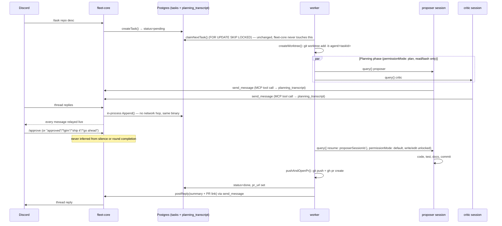
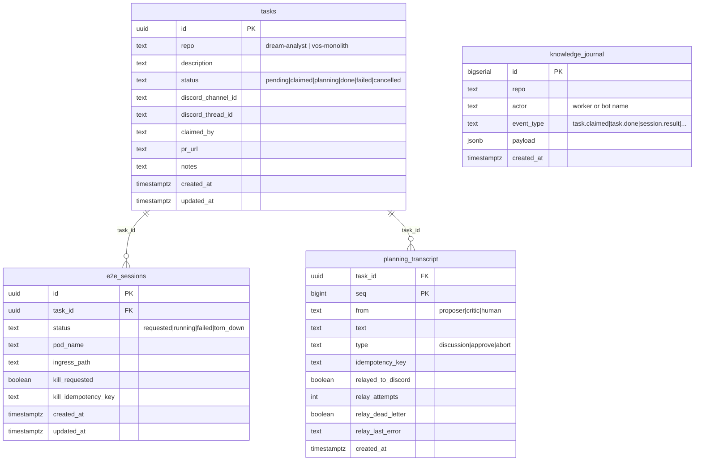

# ARCHITECTURE

Canonical topology and current features for `agent-fleet` — the WHAT. For
the WHY behind any specific choice, see [`DECISIONS.md`](DECISIONS.md) and
[`adr/`](adr/README.md). This file supersedes the old `mvp-spec.md`
(deleted) — where that spec described intent that the code later diverged
from, what's below reflects the actual implementation.

## 1. Components

| Component | Role |
|---|---|
| `fleet-core/` | Go service: Discord ingress (`/task`/`/approve`/`/stop`/`/e2e-kill`, legacy `!task repo: desc`) + planning-transcript coordination (replaces `mcp-redis`'s role — exposes `send_message`/`wait_for_messages` over a persistent MCP HTTP server) + Loki log/introspection queries, as internal packages in one binary — no cluster RBAC, folded per [`adr/0013`](adr/0013-go-fleet-core-and-e2e-provisioner-rewrite.md)'s decomposition rule (split only on RBAC/trust boundaries). Calls `e2e-provisioner`'s gRPC service for `/e2e-kill` rather than writing `e2e_sessions` directly. |
| `worker/` | The Claude Code worker (TS/Bun — the only remaining JS runtime in the fleet, since it's the sole host of `@anthropic-ai/claude-agent-sdk`'s `query()`). One persistent pod per target repo. Polls `tasks` for its repo, creates a git worktree per claimed task, runs the planning phase then the implementation phase, opens a PR, replies in the Discord thread. Talks to `fleet-core` and `e2e-provisioner` only via MCP over HTTP — never gRPC. |
| `proto/` | buf-managed `.proto` schema (lint + breaking-change CI + generate/drift check): the `E2eProvisionerService` gRPC contract (`fleet-core` → `e2e-provisioner`, the one real gRPC call in the fleet) and message shapes documenting the MCP transcript payload. Generates Go (`proto/gen/go`, own module) and TS types (`worker/src/gen`, `ts-proto`, types-only). |
| `db/schema.sql` | Shared Postgres schema (`agentfleetdb`, Pigsty-managed): `tasks` queue, append-only `knowledge_journal`, `planning_transcript` (the durable planning transcript, replacing the old Redis list — pull/cursor reads, per-task idempotency-keyed appends), and `e2e_sessions` (on-demand e2e environment lifecycle). |
| `k8s/` | Helm values for three deployed apps (`fleet-core`, `dream-analyst-worker`, `vos-monolith-worker`), consumed by two-source ArgoCD Applications defined in `infra-bootstrap`. |
| `e2e-provisioner/` | Go service (`client-go`) — the only component in the fleet with Kubernetes RBAC (namespaced `Role`, never a `ClusterRole`) to create/delete Pods/Services/IngressRoutes/Middlewares. Exposes an MCP server per task (`/mcp/:taskId`) that the worker calls to request/kill an on-demand e2e environment, proxies Playwright MCP tool calls to whichever e2e pod is live for that task, and exposes a small gRPC service `fleet-core` calls for `/e2e-kill`. Deployed as a standalone plain-manifest ArgoCD Application in `infra-bootstrap` (`gitops/platform/e2e-provisioner/`), not via `k8s/` here — unchanged RBAC/placement from [`adr/0012`](adr/0012-e2e-provisioner-standalone-app.md), rewritten Go per [`adr/0013`](adr/0013-go-fleet-core-and-e2e-provisioner-rewrite.md). |
| `e2e-runner/` | One generic pod image (code-server + the target app + a Playwright MCP server, CPU-only headless Chromium for v1) that `e2e-provisioner` spins up per task, parametrized by env vars the same way `worker/`'s single image is parametrized by `TARGET_REPO`. |

## 2. End-to-end flow

`/stop` (or "stop"/"abort"/"cancel"/"kill" in a reply) aborts at any point
in either phase, not just at a checkpoint — relayed into the same
transcript and checked first, before the word-match approval fallback.

During the implementation phase, the proposer session can also call
`request_e2e_env`/`kill_env` (an MCP server proxied through
`e2e-provisioner`, a separate MCP surface from `fleet-core`'s) to spin up a
live preview pod and drive Playwright browser tests against it — see
[`adr/0012`](adr/0012-e2e-provisioner-standalone-app.md) for the full
design and why the worker itself never gets Kubernetes RBAC to do this
directly. Teardown happens on the task reaching a terminal status or an
explicit kill from either Mohammad (`/e2e-kill`, now routed through
`fleet-core`'s gRPC call to `e2e-provisioner` rather than a direct DB
write — see [`adr/0013`](adr/0013-go-fleet-core-and-e2e-provisioner-rewrite.md))
or the agent — never merely because a PR was opened.

## 3. Planning-phase guardrails

- **Critic is opt-out, human-only.** Critique runs by default; a
  `skip_critique` boolean on `/task` (default false) skips spawning the
  critic session entirely for that task — round-cap math then counts
  proposer turns alone. The proposer never decides this for itself — see
  [`adr/0011-critic-opt-out-and-context-handoff.md`](adr/0011-critic-opt-out-and-context-handoff.md).
- **Proposer→critic context handoff.** The proposer cites the files/paths
  it read in its plan message; the critic starts from those instead of
  re-reading the repo cold, only exploring further to verify a claim or
  cover a gap (same ADR).
- **Round cap:** every `MAX_PLANNING_ROUNDS` (default 1) proposer↔critic
  exchanges without a verdict from Mohammad, both sessions are aborted and
  a checkpoint posts to Discord: reply to continue, `/approve`, or `/stop`.
- **Session-end checkpoint:** if either session ends early (crash, turn
  limit, early return) before the round cap, the same checkpoint fires
  instead of silently retrying.
- **Turn/time limits are opt-in, not default.** `MAX_TURNS_PLANNING`,
  `MAX_TURNS_IMPLEMENTATION`, and `PLANNING_TIMEOUT_MS` are all unbounded
  unless explicitly set — fixed defaults were tried and repeatedly proved
  too tight for genuine exploration of an unfamiliar codebase (see
  `worker/src/planning.ts`'s inline comments and
  [`adr/0008-unbounded-guardrail-defaults.md`](adr/0008-unbounded-guardrail-defaults.md)).
- **No cost cap.** Claude Code authenticates via `CLAUDE_CODE_OAUTH_TOKEN`
  (subscription), not a metered API key, so `total_cost_usd` in SDK
  results is notional, not a real charge.
- Every SDK message (not just the final result) streams to `kubectl logs`
  and, for assistant text, to the Discord thread — added after a real
  incident where a missing `allowedTools` entry silently denied every
  MCP tool call with zero visible signal until cost/turn-count was
  inspected after the fact.

## 4. Current features (the golden path, working today)

- `/task`, `/approve`, `/stop` Discord slash commands, guild-scoped
  (registers instantly, no global-command propagation delay).
- Legacy fallback: free-text `!task <repo>: <description>` trigger and
  plain "approved"/"stop" replies, for anyone who doesn't use the slash
  commands.
- Live relay of every proposer/critic message — and their raw assistant
  reasoning text, not just formal `send_message` posts — to the Discord
  thread as it's generated.
- Explicit-approval gate: write/edit tools are structurally absent from
  the planning-phase `allowedTools` list, not just discouraged by prompt.
- Same proposer session resumed into implementation — no restart, no
  context loss between planning and coding.
- `/e2e-kill` requests a kill via `e2e-provisioner`'s gRPC API
  (`KillE2eSession`), not a direct `e2e_sessions` write — `fleet-core`
  never reaches into a table it doesn't own (see
  [`adr/0013`](adr/0013-go-fleet-core-and-e2e-provisioner-rewrite.md)).
- Git commit identity derived live from the authenticated bot GitHub
  account (`gh api user --jq .login`), not hardcoded — stays correct if
  the bot account changes.
- Append-only `knowledge_journal` (task claimed/cancelled/done/failed,
  session results) — a shared fleet-wide record, avoiding the
  write-conflict issues a mutable shared doc would hit across concurrent
  worker pods.
- On-demand e2e test environments during implementation: a live preview pod
  (app + code-server + Playwright MCP) the agent can request, drive
  browser/API tests against, and share a preview URL for — see
  [`adr/0012`](adr/0012-e2e-provisioner-standalone-app.md). CPU-only for
  now; GPU-accelerated Chromium is a deferred fast-follow.

## 5. Deployment shape

One **persistent, always-on** worker pod per target repo
(`dream-analyst-worker`, `vos-monolith-worker`) — not one Kubernetes Job
per task. This superseded the original one-Job-per-task design on
2026-07-30; git-worktree-per-task isolation happens *inside* the
long-lived pod instead of at the pod-lifecycle level (see
[`adr/0003-persistent-worker-pod-per-repo.md`](adr/0003-persistent-worker-pod-per-repo.md)).
`replicaCount: 1`, always-on for now — KEDA scale-to-0 is not yet wired up.

Both worker apps and `fleet-core` mount a shared `ReadWriteMany` PVC
(`agent-fleet-shared-pvc`, owned by `fleet-core`'s Application — moved here
from the deleted `agent-fleet-bot.yaml`) at `/mnt/fleet-shared`, alongside
their own per-repo workspace PVC at `/workspace` for the git checkout +
per-task worktrees — also `ReadWriteMany` (not `ReadWriteOnce`, as of
`adr/0012`) so `e2e-provisioner` can mount the same PVC into an ephemeral
e2e pod via a per-task `subPath`.

`fleet-core` needs **zero cluster RBAC**, so unlike `e2e-provisioner` it
deploys via this repo's own `k8s/fleet-core.yaml` through
`common-app-chart` — no standalone-Application escape hatch needed.
`e2e-provisioner` itself is still **not** deployed from this repo's `k8s/`
— it's a standalone plain-manifest ArgoCD Application living in
`infra-bootstrap` (`gitops/platform/e2e-provisioner/`), since it needs
Kubernetes RBAC that `common-app-chart` has no way to express. See
[`adr/0012`](adr/0012-e2e-provisioner-standalone-app.md).

### Deploy pipeline

1. Push a tag → `.github/workflows/docker.yml`'s `build-push` job builds
   the `worker` image (bun-based matrix); a separate `build-push-go` job
   builds `fleet-core`/`e2e-provisioner` (Go, no package.json — tagged
   with the pushed git tag directly, same PR-safe tag computation as
   `build-push-e2e-runner`). A separate `.github/workflows/go.yml` runs
   the real correctness gate for the Go side on every push/PR: `go vet`,
   `golangci-lint`, `go test -race`, `-tags=integration` tests against a
   real Postgres service container, plus `buf lint`/`buf breaking`/a
   generate-drift check for `proto/`.
2. `docker.yml`'s `deploy` job (needs both build jobs) `sed`-bumps every
   `tag: "..."` in `k8s/*.yaml` to the pushed tag and commits straight to
   `main` (via the default `GITHUB_TOKEN`, deliberately not re-triggering
   `release.yml`'s push-to-main trigger).
3. ArgoCD's two-source Applications (chart from `infra-bootstrap`, values
   from this repo's `k8s/`) pick up the new pinned tag and sync.
4. `db/schema.sql` is applied idempotently via a `PreSync` hook on
   `fleet-core`'s Application, running `fleet-core migrate` (a Cobra-free
   subcommand — the schema is `go:embed`'d into the binary at build time)
   instead of the bot's old `psql -f` invocation.

`release.yml` runs separately (`release-it`, conventional-changelog/angular
preset) on ordinary pushes to `main`, bumping `package.json`'s version and
`CHANGELOG.md` — unrelated to the image-tag bump above.

## 6. Data model

`tasks` is the mutable queue (`db/schema.sql`); `knowledge_journal` is
append-only, written by both `fleet-core/` and `worker/` — no foreign key
between them, joined only by `repo`/timing when reading. `e2e_sessions`
**does** have a real FK to `tasks` — it's the single coordination point
between the worker's tool calls, `e2e-provisioner`'s reconcile loop, and
`fleet-core`'s `/e2e-kill` command (via `e2e-provisioner`'s gRPC API, not a
direct write — see [`adr/0013`](adr/0013-go-fleet-core-and-e2e-provisioner-rewrite.md)),
none of which talk to each other directly otherwise (see
[`adr/0012`](adr/0012-e2e-provisioner-standalone-app.md)). `planning_transcript`
replaces the old Redis list — `(task_id, seq)` PK gives the same
append-once-per-call ordering guarantee `RPUSH` gave, plus real dedup via
the `(task_id, idempotency_key)` unique index Redis never had; the
`relay_*` columns are a retry/DLQ for the Discord-posting side effect only,
not the transcript entry's own durability (see `adr/0013`).

## 7. Environment variables

### `worker/`

| Var | Default | Notes |
|---|---|---|
| `TARGET_REPO`, `TARGET_REPO_URL` | *(required)* | Which repo this pod owns |
| `WORKER_NAME` | `<TARGET_REPO>-worker` | |
| `BASE_BRANCH` | `main` | e.g. `dev` for `vos-monolith`, whose `main` only gets prod tag bumps |
| `POLL_INTERVAL_MS` | `5000` | |
| `CLAUDE_MODEL` | `claude-opus-4-8` | |
| `MAX_PLANNING_ROUNDS` | `1` | |
| `MAX_TURNS_PLANNING`, `MAX_TURNS_IMPLEMENTATION` | unbounded | opt-in caps |
| `PLANNING_TIMEOUT_MS` | `0` (unbounded) | |
| `FLEET_CORE_URL` | `http://fleet-core.agent-fleet.svc.cluster.local:8080` | in-cluster MCP endpoint for `send_message`/`wait_for_messages` — replaces `MCP_REDIS_ENTRY`/`REDIS_*` |
| `E2E_PROVISIONER_URL` | `http://e2e-provisioner.agent-fleet.svc.cluster.local:8080` | in-cluster MCP endpoint for `request_e2e_env`/`kill_env` |
| `AGENTFLEET_DB_HOST`/`PORT`/`NAME`/`USER`/`PASSWORD` | `postgres.bnei.lan`/`5432`/`agentfleetdb`/`dbuser_agentfleet`/– | |
| `GH_TOKEN` | – | bot GitHub account PAT; wired into `git`'s credential helper via `gh auth setup-git` |
| `CLAUDE_CODE_OAUTH_TOKEN` | – | minted via `claude setup-token` |

### `fleet-core/`

| Var | Default | Notes |
|---|---|---|
| `FLEET_CORE_PORT` | `8080` | MCP HTTP server + `/healthz` |
| `DISCORD_BOT_TOKEN` | – | |
| `DISCORD_TRIGGER_CHANNEL_ID` | – | |
| `LOKI_URL` | `http://loki.monitoring.svc.cluster.local:3100` | log/introspection queries |
| `E2E_PROVISIONER_GRPC_ADDR` | `e2e-provisioner.agent-fleet.svc.cluster.local:9090` | `/e2e-kill`'s gRPC client target |
| `AGENTFLEET_DB_HOST`/`PORT`/`NAME`/`USER`/`PASSWORD` | same convention as `worker/` | |

All of the above flow through Infisical (project `agent-fleet-nygh`,
env `dev`) — never committed, never in a manifest as plain text.
`REDIS_HOST`/`REDIS_PORT`/`REDIS_MAIN_PASSWORD` no longer exist — retire
them from the Infisical project once cutover is confirmed (see
`adr/0013`).

### `e2e-provisioner/`

| Var | Default | Notes |
|---|---|---|
| `NAMESPACE` | `agent-fleet` | where it creates/deletes e2e Pods/Services/IngressRoutes |
| `E2E_RUNNER_IMAGE` | `mohammaddocker/agent-fleet-e2e-runner:latest` | floating tag for v1, see `adr/0012` |
| `E2E_HOST` | `e2e.bnei.dev` | static host, path-routed per task — no wildcard DNS exists in this cluster |
| `E2E_START_CMD_DREAM_ANALYST`, `E2E_START_CMD_VOS_MONOLITH` | `bun install && bun run dev` | per-repo build/run command |
| `PORT` | `8080` | its own MCP HTTP server |
| `GRPC_PORT` | `9090` | `E2eProvisionerService` — `fleet-core`'s `/e2e-kill` client |
| `RECONCILE_INTERVAL_MS` | `10000` | teardown/orphan-cleanup poll loop |
| `AGENTFLEET_DB_*` | same convention as `worker/`/`fleet-core/` | |

No `NODE_EXTRA_CA_CERTS`/`NODE_USE_SYSTEM_CA` — that was a Bun-specific
TLS workaround (see `adr/0013`); `client-go`'s in-cluster config needs no
equivalent.

## 8. Current targets

`dream-analyst` and `vos-monolith` — real repos, each with its own
persistent worker (`k8s/dream-analyst-worker.yaml`,
`k8s/vos-monolith-worker.yaml`). `fleet-core/internal/tasks`'
`KnownRepos` (moved from `bot/src/db.ts`'s `KNOWN_REPOS`) is the source of
truth for which repos the `/task` command will accept.

## 9. Relationship to `infra-bootstrap`

- The cluster (`ukubi-cluster`), GitOps (`gitops/`), and secrets backend
  are all owned by `infra-bootstrap` — this repo consumes them, it doesn't
  redefine them.
- Only the Application/ApplicationSet registration lives in
  `infra-bootstrap`'s `gitops/apps/registry.yaml` — see that repo's
  `/add-app` skill and `gitops/README.md`.
- `fleet-core` deploys via this repo's own `k8s/fleet-core.yaml`
  (`common-app-chart`, registered in `infra-bootstrap` like any other app)
  since it needs no RBAC `infra-bootstrap` would otherwise have to grant.
  `e2e-provisioner` keeps its existing standalone-Application placement in
  `infra-bootstrap/gitops/platform/e2e-provisioner/` — only the binary's
  language changed, per `adr/0013`.
- This fleet does **not** manage `infra-bootstrap`'s own cluster ops
  (kubespray/ansible/pigsty) — blocked per that repo's own `CLAUDE.md`.
