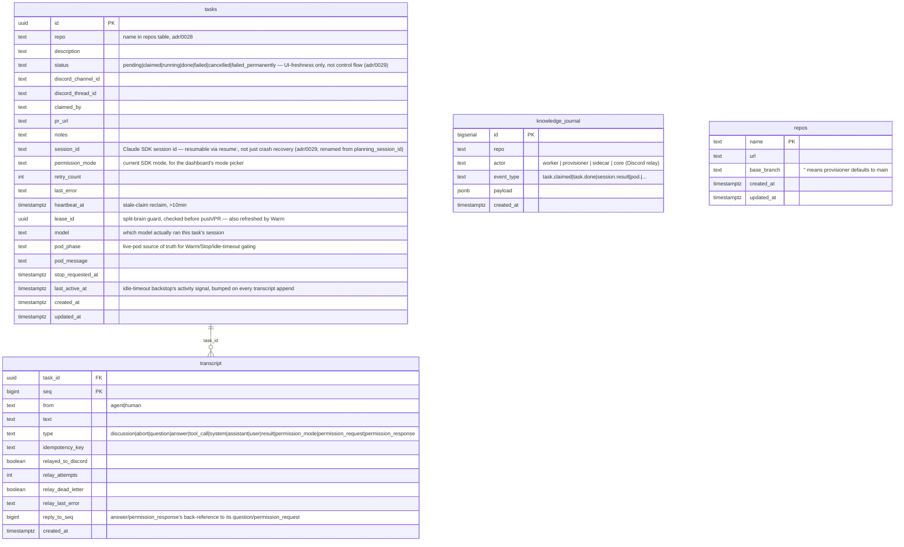

# ARCHITECTURE

Canonical topology and current features for `agent-fleet` — the WHAT. For
the WHY behind any specific choice, see [`DECISIONS.md`](DECISIONS.md) and
[`adr/`](adr/README.md). This revision reflects
[`adr/0029`](adr/0029-sessions-not-tasks-permission-prompt-not-approval-gate.md)'s
sessions redesign, superseding
[`adr/0021`](adr/0021-continuous-streaming-session.md)/
[`0025`](adr/0025-continuous-session-worker-redesign.md)'s
planning/approval-phase framing: a **session** (not a task) is now the
durable unit — repo + worktree/branch + a resumable Claude SDK session id
— and a worker pod is ephemeral compute attached to a session on demand
("warm"), not tied to the whole lifetime of a unit of work. `canUseTool`
reproduces the Agent SDK's own CLI-parity permission tiers
(`default`/`plan`/`acceptEdits`/`bypassPermissions`) via a live per-tool-call
prompt, not a prospective Write/Edit block; `/approve` no longer exists.
Earlier redesigns still apply underneath this one: `fleet-core` → `core`,
`e2e-provisioner` → `provisioner`, a `sidecar` container, and a single-shot
`worker/` ([`adr/0019`](adr/0019-shared-pvc-and-unified-provisioner.md)/
[`0020`](adr/0020-hub-and-spoke-grpc-worker-sidecar.md)); worker pods run as
`batch/v1.Job`, worktree/branch cleanup is signal-driven not status-driven,
and pod crashes get a fast-path report
([`adr/0022`](adr/0022-batch-job-worker-pod-lifecycle.md)–[`0025`](adr/0025-continuous-session-worker-redesign.md)).
Where this disagrees with anything else, this file wins for
topology/features — the reading order is `DECISIONS.md` → this file →
`adr/` → source.

## 1. Components

| Component | Role |
|---|---|
| `core/` | Go service: Discord ingress (`/task`/`/stop`/`/e2e-kill`, legacy `!task repo: desc` — `/approve` is gone) + the dispatch loop that claims pending tasks and commands the provisioner to spawn worker pods, plus a stop-grace-period sweep and an idle-timeout sweep (both `pod_phase`-gated, not `status`-gated) + `CoreService`, core's own gRPC server (agent-facing proxied MCP calls — including `ViewLogs` for agent self-debugging, wrapper-facing housekeeping calls, and the provisioner's pushed pod-lifecycle event stream) + transcript coordination (Postgres) + Loki log queries (`core/internal/lokiclient` — queries logs from all fleet components and deployed apps via LogQL, exposed via both MCP tool `view_logs` and dashboard UI) + the web dashboard's ConnectRPC API and static SPA (`dashboard/`) — all as internal packages in one binary. **The fleet's sole holder of `AGENTFLEET_DB_*` credentials** (`docs/adr/0020` point 1) and the *only* component that ever calls the provisioner (hub-and-spoke). Needs zero cluster RBAC. An `activityTrackingStore` decorator (constructed once in `cmd/core`) wraps every transcript append to bump `tasks.last_active_at`, the idle-timeout sweep's activity signal. |
| `provisioner/` | Go service (`client-go`) — the only component in the fleet with Kubernetes RBAC (namespaced `Role`, never a `ClusterRole`) to create/delete Pods/Jobs/Services/IngressRoutes/Middlewares. Owns **all** cluster-pod creation in the fleet: on-demand e2e-preview pods (bare `Pod`, unchanged behavior from `adr/0012` — long-running/interactive, killed explicitly, not run-to-completion) and worker sessions (a `batch/v1.Job` as of [`adr/0022`](adr/0022-batch-job-worker-pod-lifecycle.md) — `BackoffLimit: 0`, `TTLSecondsAfterFinished: 300s`; `core`'s heartbeat/reclaim stays the sole retry mechanism). A worker pod is now spawned either by the dispatch loop claiming a fresh task, or by `DashboardService.Warm`/`Discuss` re-warming an idle session — the provisioner's own `CreateWorkerPod` doesn't distinguish the two, both just call it. Also owns the entire git lifecycle on the one shared workspace PVC — clone, fetch, worktree add (reuse-not-wipe) — serialized per-repo by an in-process mutex (`internal/git`), so no PVC-level file lock is needed. A worktree/branch is **never** deleted as part of session teardown anymore ([`adr/0023`](adr/0023-worktree-reuse-and-branch-sweep.md)) — cleanup is a separate periodic sweep (`internal/sweep`, `[gone]`-tracked branches only) plus a manual dashboard "Worktrees" view. Holds **zero** Postgres credentials; Kubernetes itself (pod/Job existence/phase) is its durable source of truth for session state. Hosts `ProvisionerService` (gRPC server, core is the only caller) and is a gRPC client of core, pushing `PodEvent`s — including a fast-path crash report the instant a worker `Job` reaches `Failed` ([`adr/0024`](adr/0024-crash-fast-path-and-journal-read.md)). |
| `sidecar/` | Go — a real second container in every worker pod (`docs/adr/0020` point 5). Two local (`localhost`-only) surfaces, one outbound gRPC connection to `core`: an MCP server the Agent SDK session connects to (proxies `send_message`/`wait_for_messages`/`AskUserQuestion`/`request_e2e_env`/`kill_env`/`view_logs` onward to `CoreService`), and a plain HTTP/JSON API for the TS wrapper's own control-flow (`heartbeat`, `status`, `journal`, `session-id`, `still-holds-lease`, `telemetry`, `message`) — including the load-bearing `GET /human-messages` SSE feed that delivers new human input to the wrapper live, for `streamInput()` (`docs/adr/0021` point 2). An independent telemetry loop pushes `git diff --numstat`-derived branch/file-change stats to core every 5s, decoupled from anything the agent itself does. The `view_logs` tool lets agents query Loki for recent logs from fleet components (worker, sidecar, core, provisioner, e2e) or deployed apps (dream-analyst, vos-monolith) to self-debug issues during task execution. |
| `worker/` | The Claude Code worker (TS/Bun — the only remaining JS runtime in the fleet, sole host of `@anthropic-ai/claude-agent-sdk`'s `query()`; `src/session.ts`, renamed from `planning.ts` — there's no distinct "planning" phase left to name it after). **Single-shot** (`docs/adr/0019`): the provisioner hands it one `TASK_ID`/`TARGET_REPO`/`LEASE_ID`/`BASE_BRANCH`/`RESUME_SESSION_ID` via env, already pointed at a pre-cloned, pre-worktreed `/workspace` with `CLAUDE_CONFIG_DIR` redirected onto the shared PVC — the worker never runs `git clone`/`git worktree add` itself. Runs **one continuous `query()` session in streaming-input mode**, starting in the SDK's own `"default"` permission mode (CLI parity, not a forced `"plan"` gate) and resuming the prior conversation via `resume:` when `RESUME_SESSION_ID` is set. No fleet-imposed phase boundary of any kind — the agent paces its own explore/plan/implement work; `canUseTool` reproduces the SDK's own live per-tool-call permission prompt (`adr/0029`), not a Write/Edit block. The agent runs its own `git commit`/`push`/`gh pr create` via Bash inside the session; the wrapper's remaining job is bootstrap, heartbeat, status reporting, and a post-session `verifyPrExists` (`gh pr list`) check before declaring done. Talks only to its own pod's `localhost` sidecar — never Postgres, never the provisioner, never `core` directly. |
| `proto/` | buf-managed `.proto` schema (lint + breaking-change CI + generate/drift check): `CoreService` (core's gRPC server — agent/wrapper/provisioner-facing), `ProvisionerService` (the provisioner's gRPC server, renamed from `E2eProvisionerService`), and `DashboardService` (ConnectRPC, dashboard ↔ core). Generates Go (`proto/gen/go`) and TS types (`worker/src/gen`, `dashboard/src/gen`, `ts-proto`). |
| `db/migrations/` | Shared Postgres schema (`agentfleetdb`, Pigsty-managed) — sole source of truth, applied via golang-migrate by the dedicated `migration` image on a `PreSync` hook (see [`adr/0030`](adr/0030-single-source-schema-via-golang-migrate.md)). `tasks` (the queue — gains a `failed_permanently` terminal status as of [`adr/0024`](adr/0024-crash-fast-path-and-journal-read.md), a retry-cap outcome distinct from a single attempt's `failed`), append-only `knowledge_journal` (now readable via `GetJournal`, `adr/0024`), `transcript` (renamed from `planning_transcript` — durable session transcript, pull/cursor reads, idempotency-keyed appends, a `reply_to_seq` column for question/permission-request correlation). `e2e_sessions` still exists in the schema but is **no longer read or written by any Go/TS code** — e2e-session state moved to being Kubernetes-native (pod existence/phase) as of `docs/adr/0020` point 1; see §6. |
| `dashboard/` | React + Vite + TypeScript + Tailwind/DaisyUI SPA — task list, **task creation** (`NewTaskDialog.tsx`, `DashboardService.CreateTask` — an alternative to Discord's `/task`, not a replacement), task detail (live transcript via a Connect server-streaming RPC, Warm/Stop/kill-e2e buttons, a mode picker showing `default`/`plan`/`acceptEdits`/`bypassPermissions` with the real active mode highlighted, code-server link, `AskUserQuestion`/`PermissionCard`/`PlanCard` answer forms — `adr/0018`/`0029`), talking to `core` via a generated `@connectrpc/connect-web` client. Built into and served by `core`'s binary — not deployed on its own. |
| `k8s/` | This repo's own deploy manifests: `core.yaml` (Helm values for `common-app-chart`, zero RBAC) and `provisioner/` (a standalone plain-manifest directory — `Deployment`/`Service`/`ServiceAccount`/`Role`/`InfisicalSecret`/`NetworkPolicy`/`PersistentVolumeClaim` — since it needs RBAC `common-app-chart` can't express). Both referenced from `infra-bootstrap`'s `gitops/` (see §9). |
| `e2e-runner/` | One generic pod image (code-server + the target app + a Playwright MCP server, CPU-only headless Chromium for v1) the provisioner spins up per on-demand e2e request, parametrized by env vars the same way `worker/`'s image is parametrized by `TARGET_REPO`. Unchanged by this redesign. |
| `thot` | (design decided, not yet built — [`adr/0035`](adr/0035-thot-cluster-agent.md)) A standing, GitOps-deployed cluster agent with its own Kubernetes RBAC over `ukubi-cluster` — the fleet's *second* RBAC-holding component, deployed independently of `core`/`provisioner` (own `ServiceAccount`/`Role`/`ClusterRole` as a human-reviewed manifest in infra-bootstrap's `gitops/`, never created by `provisioner`). Reachable directly by worker sidecars, cluster alerts, and humans via its own protobuf/gRPC service — a stated exception to hub-and-spoke for the live call path only; persistence still flows through `core`. Live mutation is gated per-call by `canUseTool`; durable changes go through the normal git + PR flow. |

## 2. End-to-end flow

```mermaid
sequenceDiagram
    participant Dash as Dashboard (primary interaction surface)
    participant D as Discord (secondary/notification)
    participant C as core (dispatch, CoreService gRPC, DashboardService)
    participant PG as Postgres (tasks + transcript)
    participant P as provisioner (ProvisionerService gRPC, git, k8s)
    participant SC as sidecar (in worker pod)
    participant W as worker (TS wrapper, in worker pod)
    participant Ag as Agent SDK session (streaming-input)

    Dash->>C: CreateTask(repo, description) [or D->>C: /task]
    C->>PG: CreateTask() → status=pending

    loop dispatch loop, every 30s + nudged (core/internal/dispatch)
        C->>PG: ClaimNextTask(maxInFlight, maxRetries) (FOR UPDATE SKIP LOCKED — headroom + retry-cap check folded into the one query)
    end
    C->>P: CreateWorkerPod(taskId, repo, repoUrl, baseBranch, leaseId, resumeSessionId) [gRPC]
    P->>P: EnsureRepoCloned / CreateWorktree (reuse-not-wipe, per-repo in-process mutex)
    P->>SC: client-go creates a batch/v1.Job, two containers: worker + sidecar (adr/0022)
    P-->>C: ReportPodEvents stream (created→scheduled→running→...→[fast-path Failed], adr/0024) [gRPC]
    C->>PG: journal every pod event (knowledge_journal); pod_phase drives concurrency/idle/stop checks now, not status

    W->>Ag: query() streaming-input, permissionMode="default", resume: RESUME_SESSION_ID if set
    Ag->>SC: mcp tool call (local MCP, e.g. send_message)
    SC->>C: SendMessage [gRPC]
    C->>PG: Append to transcript (activityTrackingStore bumps last_active_at)
    C-->>D: relay loop posts allowlisted types only (adr/0025 pt.5) — Discord is notification-only now

    Dash->>C: Discuss(taskId, text) — auto-warms an idle session first if needed
    C->>PG: Append (from=human, type=discussion)
    C-->>SC: StreamHumanMessages [gRPC server-stream]
    SC-->>W: GET /human-messages (SSE)
    W->>Ag: streamInput(reply text)

    Ag->>SC: tool call the current permission mode would prompt for
    SC->>C: (via canUseTool, blocked) Append transcript entry, type=permission_request
    C-->>Dash: PermissionCard/PlanCard renders the pending request
    Dash->>C: RespondToPermission(taskId, seq, decisionJson)
    C->>PG: AppendReply(type=permission_response, reply_to_seq=seq)
    C-->>SC: StreamHumanMessages delivers the response
    SC-->>W: SSE event, type=permission_response
    W->>Ag: resolves the matching canUseTool Promise — allow/deny

    Ag->>Ag: write code, tests, docs; commit, push, gh pr create — all via Bash, in-session
    W->>W: verifyPrExists(): gh pr list --head <branch> (post-session check, not trusted from the agent's own claim)
    W->>SC: POST /status {done, prUrl} → SetTaskStatus [gRPC]
    SC->>C: SetTaskStatus [gRPC]
    C->>PG: tasks.status=done, pr_url set (status is UI-freshness only now, not control flow)
    C->>P: TearDownSession(taskId, WORKER) [gRPC] — opportunistic, on any terminal status
    P->>P: delete Job (worktree/branch/session_id untouched — reuse + periodic sweep, adr/0023)
    C-->>Dash: relay posts summary + PR link
```

Re-opening a task later doesn't restart this diagram from the top: `Dash->>C: Warm(taskId)` (or the auto-warm inside `Discuss` above) calls the exact same `CreateWorkerPod` the dispatch loop calls, with `resumeSessionId` set from the task's saved `session_id` — same worktree (already preserved), same Claude conversation (resumed via `CLAUDE_CONFIG_DIR` + `resume:`), new pod. `Warm` rejects with `CodeFailedPrecondition` if the task is still `pending` (the dispatch loop's `ClaimNextTask` already owns that first pod — warming it too would double-dispatch) or already has a live pod, and `CodeResourceExhausted` if the fleet is already at `MAX_IN_FLIGHT_TASKS` warm pods.

`/stop` (Discord) or the dashboard's Stop button both post a cooperative
`abort` transcript entry; `query.interrupt()` — the SDK's own graceful stop
primitive, not a process kill — plus `abortController.abort()` as a
backstop for the case where the session is idle and there's nothing active
to interrupt (`docs/adr/0021` point 3). If the worker doesn't honor it
within the stop-grace window, `core`'s dispatch loop force-tears the pod
down the same way; either way `tasks.status` is **not** touched — the
session stays idle and resumable via `Warm`, not terminal. The same
force-teardown, without a human asking, fires from a second sweep after
`IDLE_TIMEOUT_MS` of no real transcript activity (`ListIdleWarmTaskIDs`,
gated on `pod_phase` + `last_active_at`, not status).

Every `AskUserQuestion`/permission request carries the transcript's own
append-order sequence number; the human's reply threads back via a
`reply_to_seq` column (`transcript`), so a second question or tool-call
prompt posted before the first is answered can't have its reply
misattributed — a real gap under concurrent/rapid questions or parallel
tool calls, not a hypothetical one. Both Discord and the dashboard can
answer a question; only the dashboard renders/answers a permission
request — `discordSafeTypes` deliberately excludes
`permission_request`/`permission_response` (same poor-fit reasoning
`adr/0018` already gave for `AskUserQuestion`'s structured payload).

During implementation, the agent can call `request_e2e_env`/`kill_env` — a
three-hop proxy (agent → sidecar's local MCP → `core`'s `CoreService` →
`provisioner`'s `ProvisionerService`) to spin up a live preview pod and
drive Playwright browser tests against it, per `docs/adr/0012`'s original
design (RBAC boundary unchanged) as extended by `docs/adr/0020`'s
hub-and-spoke rule (no direct worker→provisioner path exists anymore, even
for this). Teardown happens on the task reaching a terminal status
(`core`'s opportunistic trigger in `SetTaskStatus`) or an explicit kill
(`/e2e-kill` from Discord, or the agent's own `kill_env`) — never merely
because a PR was opened.

**MCP is purely local** (agent ↔ its own pod's sidecar, over `localhost`).
**gRPC is the only inter-process/inter-pod protocol anywhere in the
fleet** — there is no direct HTTP MCP surface reachable across a pod
boundary anymore (`docs/adr/0020` point 6).

## 3. Permission model

Supersedes the old "Planning-phase guardrails" — there's no fleet-imposed
phase left to guard. `canUseTool` reproduces the Agent SDK's own CLI-parity
permission tiers instead of a second, fleet-specific gate on top of them
(`adr/0029`).

- **`canUseTool` does zero tool classification of its own.** The old
  `MUTATING_BASH_RE` heuristic and the hardcoded `Write`/`Edit` check are
  both deleted, not widened. The SDK's real `permissionMode`
  (`'default' | 'plan' | 'acceptEdits' | 'bypassPermissions' | 'delegate' |
  'dontAsk'`) already decides *when* `canUseTool` gets invoked —
  `bypassPermissions` skips it entirely, `acceptEdits` skips it for file
  edits, `plan` blocks mutation without invoking it, `default` invokes it
  for anything not auto-safe (`Read`/`Glob`/`Grep`/`WebSearch`/`WebFetch`
  stay in `allowedTools`, so the SDK never even calls the callback for
  those). `canUseTool`'s only remaining job: post a `permission_request`
  transcript entry and block on the matching `permission_response` —
  generalizing `ExitPlanMode`'s own original ask-and-block-and-resolve
  pattern from one hardcoded case to a `Map<seq, resolver>` so parallel
  tool calls in one assistant turn each get their own correlated prompt.
- **Sessions start in `"default"` mode**, not a forced `"plan"` gate —
  matches running `claude` locally with no flags. `plan` is still fully
  available, just as one selectable mode via the dashboard's mode picker
  (`default`/`plan`/`acceptEdits`/`bypassPermissions`, highlighting the
  real active mode via a new `tasks.permission_mode` column) rather than a
  mandatory starting state.
- **`Approve` no longer exists** — proto RPC, Go handler, Discord
  `/approve` command and handler are all deleted (including explicit
  stale-command pruning: `discordgo.ApplicationCommandCreate` only upserts
  by name, it never deregisters a dropped command on its own).
  `SetPermissionMode` (widened to accept `default`/`plan` alongside the
  pre-existing `acceptEdits`/`bypassPermissions`, `adr/0027`) is the only
  mode lever now; a new `RespondToPermission` RPC — `AnswerQuestion`'s
  sibling, same `AppendReply`-by-seq shape — answers individual
  `canUseTool` prompts. `docs/adr/0005`'s "never inferred from silence or
  sentiment" rule is unchanged: a permission decision is still a real,
  structured RPC call, never inferred.
- **Complexity-gated interview/doubt, no `/task` knob.** The agent decides
  for itself, per task, whether `architecture-interview` and/or
  `doubt-driven-development` apply, using each skill's own "when to use"
  criteria. Mohammad can still interject live in the thread at any point
  ("skip the interview" / "run doubt on this") — narrative discussion is
  fed straight into the running session via `streamInput()`
  (`docs/adr/0021`), reaching the model live instead of waiting for it to
  poll — see [`adr/0017`](adr/0017-single-session-planning-pipeline.md).
- **No round cap, no phase boundary — the agent paces itself.** One
  `taskPrompt` spans the whole session; the agent decides when to explore,
  when to plan out loud, and when to implement, ending its final message
  with a `PR_READY:` summary line. That line is now also the session's own
  completion signal for `runSession`'s loop (there's no `approved` boolean
  left to break on) — a "success" result only ends the session once
  `PR_READY:` appears in the agent's own text; anything else means the
  session paused naturally between turns, waiting for the next streamed
  input.
- **`AskUserQuestion`, correlated by sequence and answerable from Discord
  or the dashboard.** A real `AskUserQuestion` MCP tool (proxied through
  the sidecar → `core`) posts a `question`-type `transcript` entry and
  long-polls until a matching `answer` entry appears, threaded via a
  `reply_to_seq` column so a second question posted before the first is
  answered can't have its reply misattributed. `TranscriptEntry.reply_to`
  is now wire-visible (the Go struct already carried it; the proto message
  didn't) — the same correlation now also covers permission requests, not
  just questions.
- **Every raw SDK message is relayed to Discord through an allowlist, not
  a denylist.** `logSdkMessage` relays every SDK message type;
  `relay.go`'s `discordSafeTypes` allowlist decides what actually reaches
  the thread — deliberately still excludes `permission_request`/
  `permission_response` (same poor-fit reasoning `adr/0018` already gave
  for `AskUserQuestion`'s structured payload; the dashboard is the sole
  interactive surface for permission decisions). A denylist would let any
  new raw SDK message type leak by default — a real secret-leak risk (Bash
  stdout/stderr, file contents).
- **Turn/time limits are opt-in, not default.** `MAX_TURNS` aside, nothing
  else is bounded unless explicitly set — see
  [`adr/0008`](adr/0008-unbounded-guardrail-defaults.md). There's no round
  concept left to cap.
- **No cost cap.** Claude Code authenticates via `CLAUDE_CODE_OAUTH_TOKEN`
  (subscription), not a metered API key, so `total_cost_usd` in SDK
  results is notional, not a real charge.
- Every SDK message (not just the final result) is logged
  (`worker/src/session.ts`'s `logSdkMessage`), and every assistant text
  block is relayed into the transcript (`sidecar.pushMessage`) — added
  after a real incident where a missing `allowedTools` entry silently
  denied every MCP tool call with zero visible signal until cost/turn-count
  was inspected after the fact.

## 4. Current features (the golden path, working today)

- `/task`, `/stop`, `/e2e-kill` Discord slash commands, guild-scoped
  (registers instantly, no global-command propagation delay) — `/approve`
  is deleted (`adr/0029`), and stale registrations get actively pruned on
  every `RefreshCommands` call, not just left unhandled.
- Legacy fallback: free-text `!task <repo>: <description>` trigger and a
  plain "stop" reply.
- **Tasks can also be created from the dashboard, not just Discord** —
  `DashboardService.CreateTask` calls the exact same `tasks.Store.CreateTask`
  path the Discord `/task` handler does, just with a nil
  `discord_channel_id`/`discord_thread_id` (that column is nullable as of
  this feature). No separate task-creation logic to keep in sync: a
  dashboard-created task has no Discord thread at all, and
  `core/internal/discord/session.go`'s `PostToThread` already no-ops when
  `ThreadID` is nil, so relay/stop work identically regardless of which
  surface created the task — stop for a dashboard-only task just has to
  happen from the dashboard instead of a Discord reply, since there's no
  thread to reply in. The dashboard is the primary interaction surface now
  (`adr/0029`); Discord is secondary/notification-only.
- Live relay of every message on the transcript — plan drafts, interview
  questions, doubt-cycle status, raw assistant narration — to the Discord
  thread as it's generated, via `core`'s own relay loop
  (`internal/transcript/relay.go`), regardless of whether the message came
  from the agent's own `send_message` tool call or the sidecar's
  independent telemetry/wrapper housekeeping calls. Permission
  requests/responses are deliberately excluded — dashboard-only.
- Structured self-review via real, vendored Claude Code skills
  (`doubt-driven-development`'s fresh-context `Task`-tool subagent,
  `architecture-interview`'s stakeholder elicitation) — see
  [`adr/0017`](adr/0017-single-session-planning-pipeline.md).
- **One continuous Agent SDK session per warm pod**, streaming-input mode,
  one `taskPrompt`, no fleet-imposed phase boundary between planning and
  implementation — no restart, no context loss within a pod's lifetime.
  `resume: sessionId` is now a real, general-purpose mechanism, not
  crash-recovery-only (`docs/adr/0016`'s originally-described
  `CLAUDE_CONFIG_DIR` redirect is actually wired up as of `adr/0029`) — a
  pod that re-warms an idle session continues the same conversation.
- Live permission model: `canUseTool` reproduces the SDK's own CLI-parity
  tiers via a generic per-tool-call prompt, not a Write/Edit block — see
  §3.
- `/e2e-kill` requests a kill via `core`'s `CoreService.KillE2eEnv`, proxied
  to the provisioner's `ProvisionerService.KillE2ESession` — `core` never
  writes e2e-session state directly, and e2e-session state itself is
  Kubernetes-native now (§6), not a Postgres row.
- **Explicit warm/stop pod lifecycle.** A `Warm` RPC (or `Discuss`'s
  auto-warm on the first message to an idle session) boots a pod for a
  session that already exists but has no live pod right now, threading a
  saved `session_id` through as `resume_session_id`. Neither `Warm`,
  `Stop`, nor the idle-timeout sweep ever touch `tasks.status` — pod
  lifecycle is `tasks.pod_phase` alone, and the concurrency cap
  (`MAX_IN_FLIGHT_TASKS`, reinterpreted as "max warm pods") is enforced
  against a live `pod_phase` count, not the claim-queue-only check
  `ClaimNextTask` uses for a task's first pod.
- **Idle-timeout backstop.** A warm pod with no real transcript activity
  for `IDLE_TIMEOUT_MS` (default 30min) gets torn down automatically —
  same mechanism as a force-stopped pod, gated on `tasks.last_active_at`
  (bumped by an `activityTrackingStore` decorator on every transcript
  append, not the sidecar's git-diff-gated telemetry or the unconditional
  heartbeat timer) rather than a human's explicit Stop.
- Git commit identity derived live from the authenticated bot GitHub
  account (`gh api user --jq .login`), not hardcoded — both the
  provisioner (its own clone/fetch) and the worker (its own push/PR) do
  this independently, since the two processes don't share `$HOME`.
- Append-only `knowledge_journal` — task lifecycle events, session
  results, and provisioner pod-lifecycle events, all funneled through
  `core`'s single Postgres connection, now readable via a typed
  `GetJournal` RPC instead of direct-SQL-only (`adr/0024`).
- **Worktree reuse, not wipe, plus a periodic sweep.** `CreateWorktree`
  returns immediately if the task's worktree path already exists — no git
  command runs on a retry. Worktree/branch deletion is never a side effect
  of session teardown or task status anymore; cleanup is a separate
  periodic sweep (`provisioner/internal/sweep`, `git fetch --prune` +
  `[gone]`-ref detection) plus a manual "Worktrees" dashboard view for
  anything the sweep can't reach (e.g. a branch never pushed)
  (`adr/0023`).
- On-demand e2e test environments during implementation, three-hop
  proxied through `core` (§2) — see
  [`adr/0012`](adr/0012-e2e-provisioner-standalone-app.md). CPU-only for
  now; GPU-accelerated Chromium is a deferred fast-follow.
- **Fleet-wide concurrency, not one task per repo.** Any number of tasks
  across any known repo can be in flight simultaneously, up to
  `MAX_IN_FLIGHT_TASKS` (default 5) — `core`'s dispatch loop claims
  repo-agnostically (`docs/adr/0019`).
- **Fleet-wide shared file space, backed by Garage S3** (`docs/adr/0030`).
  A flat bucket (`agent-fleet-files`), `core` the sole credential holder —
  it only mints short-lived presigned PUT/GET URLs
  (`ListFiles`/`GetFileUploadUrl`/`GetFileDownloadUrl`/`DeleteFile`, on
  both `CoreService` and `DashboardService`). Agents reach it via four new
  sidecar MCP tools (`list_shared_files`, `get_shared_file_upload_url`,
  `get_shared_file_download_url`, `delete_shared_file`) and move bytes
  themselves via `curl` from Bash — the tools never carry file contents.
  The dashboard's `Files` page does the human-side equivalent, uploading/
  downloading directly against Garage from the browser.
- **Crash recovery with a fast path, not just a 10-minute wait.** Worker
  sessions are single-shot `batch/v1.Job`s; the instant a `Job` reaches
  `Failed`, the provisioner's `EventReporter` pushes a crash event that
  `core` turns into `tasks.MarkCrashed` — backdating `heartbeat_at` so the
  *next* dispatch tick reclaims it immediately, not after the old
  10-minute stale-heartbeat wait. That heartbeat reclaim is kept as the
  fallback for a missed push event, not replaced. `ClaimNextTask` also
  gets a `maxRetries` cap (`MAX_TASK_RETRIES`, default 3) — a reclaim at
  the cap sets `failed_permanently` instead of retrying again
  (`adr/0024`). The provisioner's reconcile loop still garbage-collects
  the `Job` itself if it reached a terminal k8s phase without `core` ever
  calling `TearDownSession` for it.

## 5. Deployment shape

**One shared `ReadWriteMany` PVC** (`agent-fleet-workspace`, owned by the
provisioner's own manifests) replaces the old two per-repo workspace PVCs
(`docs/adr/0019`). Layout: `<root>/repos/<repo>/` (one clone per repo,
fetched in place, never re-cloned per task), `<root>/worktrees/<taskId>/`
(one worktree per task, keyed by the already-globally-unique task ID, not
nested per repo), and `<root>/cache/<repo>/` (per-repo Go module/build and
Bun install caches, mounted into e2e-preview pods only at `/cache` via
`GOMODCACHE`/`GOCACHE`/`BUN_INSTALL_CACHE_DIR`, so `E2E_START_CMD`'s
`go mod`/`bun install` step doesn't re-download from scratch on every
session). Only the provisioner (clone/fetch/worktree add, reuse-not-wipe,
`adr/0023`) and each task's worker+sidecar/e2e-runner pod ever touch it —
`core` holds zero PVC access, matching its zero-RBAC design. The old
`agent-fleet-shared-pvc` (`/mnt/fleet-shared`, skills/journal-mirror/MCP
configs) is dropped entirely — confirmed via a full-repo grep that nothing
in `core`/`provisioner`/`sidecar`/`worker` references it anymore; the
planning skills plugin now ships baked into the worker image
(`PLANNING_SKILLS_PLUGIN_PATH = "/app/worker/skills/agent-fleet-planning"`,
unchanged from before this redesign — the PVC-resident-skills idea from
`docs/adr/0019` point 6 was not carried into the actual implementation).

**Worker sessions are single-shot, two containers, spawned per task — not
persistent, not one Deployment per repo.** The provisioner builds a
`batch/v1.Job` directly via `client-go` (`provisioner/internal/k8s/pod.go`,
`adr/0022`) for worker sessions; on-demand e2e-preview sessions stay a bare
`Pod` (long-running/interactive, killed explicitly rather than run-to-
completion — `Job` semantics don't fit):
- `worker` container: the TS/Bun image, `TASK_ID`/`TARGET_REPO`/
  `TASK_DESCRIPTION`/`LEASE_ID`/`BASE_BRANCH`/`SIDECAR_MCP_ADDR`/
  `SIDECAR_API_ADDR`/`GH_TOKEN`/`WORKTREE_PATH`/`CLAUDE_CONFIG_DIR`/
  `RESUME_SESSION_ID` env, `250m`–`2000m` CPU / `512Mi`–`2Gi` memory.
- `sidecar` container: the Go image, `TASK_ID`/`TARGET_REPO`/`MCP_PORT`
  (9090)/`LOCAL_API_PORT` (9091)/`WORKTREE_PATH` env, `50m`–`250m` CPU /
  `64Mi`–`256Mi` memory.
- Both mount the **whole** PVC at `/workspace` — not a per-task `subPath`.
  A linked git worktree's `.git` file is an absolute-path gitlink back to
  `repos/<repo>/.git/worktrees/<taskId>` (`HEAD`/`index`/`commondir`); a
  `subPath` scoped to just `worktrees/<taskId>` cuts that path off, so
  every git command in the pod fails with "not a git repository" (found
  live, 2026-08-05, fixed in PR #30). `WORKTREE_PATH` (the provisioner's
  own `CreateWorktree` result, e.g. `/workspace/worktrees/<taskId>`) tells
  worker/sidecar where their task's checkout lives within that shared
  view; isolation between concurrent tasks' worktrees is by directory
  naming (keyed by task ID) only, not a mount boundary.
- `RestartPolicy: Never` on the Job's pod template — a crashed pod is not
  restarted by Kubernetes; recovery is `core`'s crash fast-path/stale-
  heartbeat reclaim (§4), not `kubelet` or the Job's own (deliberately
  disabled, `BackoffLimit: 0`) retry.

**`core` needs zero cluster RBAC**, so it deploys via this repo's own
`k8s/core.yaml` through `common-app-chart` (two-source ArgoCD Application,
chart from `infra-bootstrap`, values from here) — no standalone-Application
escape hatch needed. `core` is this repo's first app with a real listening
`service.port` (`8080`, publicly reachable — the dashboard/`/healthz`) and
a second, `ClusterIP`-only gRPC port (`CORE_GRPC_PORT`, `9090`, never
publicly routed). Its HTTP ingress is gated behind the shared
`basic-admin-auth` Traefik Middleware (already gating pgweb/Alertmanager).

**`provisioner` needs real RBAC**, so — unlike `core` — it is **not**
deployed through `common-app-chart`. As of this redesign its manifests
moved *into this repo* (`k8s/provisioner/`: `Deployment`, `Service`,
`ServiceAccount`, namespaced `Role`, `InfisicalSecret`, `NetworkPolicy`,
`PersistentVolumeClaim`), registered in `infra-bootstrap` as a standalone
plain-manifest ArgoCD Application (`gitops/bootstrap/
provisioner-application.yaml`) pointed at this repo instead of
`infra-bootstrap/gitops/platform/e2e-provisioner/` (the old location, now
deleted) — see §9. Its `Role` (`k8s/provisioner/role.yaml`) grants
`batch/jobs` alongside `pods`/`services`/`ingressroutes`/`middlewares` as
of `adr/0022` — a gap the fake-clientset unit tests didn't catch, only a
real `kind`-cluster smoke test did.

### Deploy pipeline

1. Push a tag → `.github/workflows/docker.yml`'s `build-push` job builds
   the `worker` image (Bun-based); `build-push-go` builds `core`/
   `provisioner`/`sidecar` (Go, no `package.json` — tagged with the pushed
   git tag directly). A separate `.github/workflows/go.yml` runs the real
   correctness gate for the Go side on every push/PR: `go vet`,
   `golangci-lint`, `go test -race`, `-tags=integration` tests against a
   real Postgres service container, plus `buf lint`/`buf breaking`/a
   generate-drift check for `proto/`.
2. `docker.yml`'s `deploy` job (needs all build jobs) `sed`-bumps every
   `tag: "..."` in `k8s/core.yaml` (Helm-values shape) and every
   `image: repo:tag` in `k8s/provisioner/*.yaml` (plain-manifest shape,
   scoped to `mohammaddocker/agent-fleet-{core,provisioner,worker,sidecar}`
   — `e2e-runner`'s floating `:latest` is deliberately excluded) to the
   pushed tag, and commits straight to `main` (via the default
   `GITHUB_TOKEN`, deliberately not re-triggering `release.yml`'s
   push-to-main trigger).
3. ArgoCD's Applications (`core` via a two-source chart Application,
   `provisioner` via its own standalone plain-manifest Application) pick up
   the new pinned tags and sync.
4. `db/migrations/` is applied via a `PreSync` hook on `core`'s
   Application, running the dedicated `migration` image (`migrate/migrate`
   CLI + `db/migrations/` COPY'd in at build time — see `docs/adr/0030`).
   `core` itself no longer embeds or applies any schema.

`release.yml` runs separately (`release-it`, conventional-changelog/
angular preset) on ordinary pushes to `main`, bumping `package.json`'s
version and `CHANGELOG.md` — unrelated to the image-tag bump above; the
whole fleet (`core`/`provisioner`/`sidecar`/`worker`/`e2e-runner` images)
still ships as one version/CHANGELOG, one repo.

## 6. Data model



`tasks` is the mutable queue and, as of `adr/0029`, the durable session
record — `status` is a loose UI-freshness signal now, not control flow;
`pod_phase` is the real "is there a live pod right now" source of truth
`Warm`/`Stop`/the idle-timeout sweep all gate on instead.
`knowledge_journal` is append-only, written only by `core` now (every
writer — worker, sidecar, provisioner — goes through `core`'s
`CoreService.AppendJournal`/`ReportPodEvents`, since `core` is the fleet's
sole Postgres-credential holder). `transcript` (renamed from
`planning_transcript` — there's no distinct "planning" phase left to name
it after) gives the same append-once-per-call ordering guarantee a durable
list would, plus real dedup via the `(task_id, idempotency_key)` unique
index; the `relay_*` columns are a retry/DLQ for the Discord-posting side
effect only, not the transcript entry's own durability. The `tool_call`
transcript type carries the sidecar's independent telemetry (git
diff/branch stats) — `internal/transcript/relay.go`'s `relayPending` skips
this type, so it never posts to Discord (same treatment
`permission_request`/`permission_response` get, for a different reason —
see §3).

`repos` is the dashboard-editable target-repo config (docs/adr/0028) — no
`tasks.repo` FK, deliberately, so deleting a repo doesn't retroactively
break historical task rows. Replaces the old hardcoded `tasks.KnownRepos`
Go map; `core/internal/repos.Store` reads/writes it, and a mutation fires
`SetOnChange` to live-refresh Discord's `/task` command choices with no
redeploy needed.

**`e2e_sessions` still exists in `db/migrations/` but is dead code as of
this redesign** — a full grep across
`core/`, `provisioner/`, and `worker/` finds zero reads or writes against
it. E2e-session existence/status is derived live from Kubernetes pod
state instead (`provisioner/internal/grpcserver`'s `GetE2ESessionStatus`/
`CreateE2ESession` call `k8sc.GetPod`, never a Postgres query) —
`docs/adr/0020` point 1's "the provisioner holds no DB credentials at all"
made the table's original purpose (the one coordination point between
worker tool calls, the provisioner's reconcile loop, and `/e2e-kill`)
moot. Left in the schema rather than dropped as part of this doc-only
pass; dropping it is a small, separate follow-up if anyone confirms
nothing external still queries it directly.

## 7. Environment variables

### `core/`

| Var | Default | Notes |
|---|---|---|
| `CORE_PORT` | `8080` | HTTP: `/healthz`, dashboard ConnectRPC API, static SPA |
| `CORE_GRPC_PORT` | `9090` | `CoreService` — the provisioner's `ReportPodEvents` client and every worker pod's sidecar connect here |
| `GARAGE_S3_ENDPOINT` | `https://s3.bnei.dev` | Must stay externally reachable, not `garage.bnei.lan` — presigned URLs sign the endpoint host in, and the dashboard's browser can't resolve a `.lan` name (`docs/adr/0030`) |
| `GARAGE_FILES_BUCKET` | `agent-fleet-files` | The fleet-wide shared file space's one bucket |
| `AGENTFLEET_FILES_S3_ACCESS_KEY` / `_SECRET` | – | `core`'s the sole holder — it only mints presigned PUT/GET URLs, never proxies bytes (`docs/adr/0030`) |
| `AGENTFLEET_DB_HOST`/`PORT`/`NAME`/`USER`/`PASSWORD` | `postgres.bnei.lan`/`5432`/`agentfleetdb`/`dbuser_agentfleet`/– | the *only* component in the fleet with these |
| `DISCORD_BOT_TOKEN` | – | |
| `DISCORD_TRIGGER_CHANNEL_ID` | – | |
| `LOKI_URL` | `http://loki.monitoring.svc.cluster.local:3100` | log/introspection queries |
| `PROVISIONER_GRPC_ADDR` | `provisioner.agent-fleet.svc.cluster.local:9090` | `ProvisionerService` client target |
| `MAX_IN_FLIGHT_TASKS` | `5` | same knob, reinterpreted as "max warm pods" (`adr/0029`) — gates both `ClaimNextTask`'s claim of a fresh task and `Warm`'s `CountLivePods` check for re-warming an idle session (`docs/adr/0019`/`0020`) |
| `MAX_TASK_RETRIES` | `3` | `ClaimNextTask`'s reclaim cap — a reclaim past this sets `failed_permanently` instead of retrying (`adr/0024`) |
| `STOP_GRACE_MS` | `30000` | how long the dispatch loop waits after a Stop request before force-tearing down a pod that hasn't gone terminal on its own |
| `IDLE_TIMEOUT_MS` | `1800000` (30min) | the idle-timeout backstop — a warm pod with no real transcript activity this long gets torn down automatically (`adr/0029`) |

### `provisioner/`

| Var | Default | Notes |
|---|---|---|
| `NAMESPACE` | `agent-fleet` | where it creates/deletes Pods/Services/IngressRoutes/Middlewares |
| `E2E_RUNNER_IMAGE` | `mohammaddocker/agent-fleet-e2e-runner:latest` | floating tag for v1 |
| `WORKER_IMAGE` | `mohammaddocker/agent-fleet-worker:latest` | pinned by the deploy job in practice |
| `SIDECAR_IMAGE` | `mohammaddocker/agent-fleet-sidecar:latest` | pinned by the deploy job in practice |
| `WORKSPACE_PVC` | `agent-fleet-workspace` | the one shared RWX PVC name |
| `WORKTREES_ROOT` | `/workspace` | where that PVC is mounted inside the provisioner's own pod |
| `E2E_HOST` | `e2e.bnei.dev` | static host, path-routed per task |
| `E2E_START_CMD_DREAM_ANALYST`, `E2E_START_CMD_VOS_MONOLITH` | `bun install && bun run dev` | per-repo build/run command |
| `PORT` | `8080` | HTTP (currently unused beyond health, kept for parity) |
| `GRPC_PORT` | `9090` | `ProvisionerService` |
| `CORE_GRPC_ADDR` | `agent-fleet-core.agent-fleet.svc.cluster.local:9090` | where `ReportPodEvents` streams to |
| `RECONCILE_INTERVAL_MS` | `10000` | terminal-worker-pod GC poll (`internal/reconcile`) |
| `GH_TOKEN` | – | for the provisioner's own clone/fetch auth (`gh auth setup-git`), and forwarded verbatim into every worker pod's `worker` container env |

No `AGENTFLEET_DB_*` here at all — see §6.

### `sidecar/` (per worker pod, injected by the provisioner at pod creation)

| Var | Default | Notes |
|---|---|---|
| `TASK_ID` | *(required)* | |
| `TARGET_REPO` | – | |
| `CORE_GRPC_ADDR` | `agent-fleet-core.agent-fleet.svc.cluster.local:9090` | its one outbound gRPC connection |
| `WORKTREE_PATH` | `/workspace` | for the telemetry loop's `git diff`/`rev-parse` calls |
| `MCP_PORT` | `9090` | agent-facing local MCP server |
| `LOCAL_API_PORT` | `9091` | wrapper-facing plain HTTP/JSON API |

### `worker/` (per worker pod, injected by the provisioner at pod creation)

| Var | Default | Notes |
|---|---|---|
| `TASK_ID`, `TARGET_REPO`, `LEASE_ID` | *(required)* | `LEASE_ID` is refreshed by `Warm` too, not just `ClaimNextTask` — or `StillHoldsLease` would always fail against a stale/NULL `tasks.lease_id` |
| `TASK_DESCRIPTION` | – | |
| `BASE_BRANCH` | `main` | e.g. `dev` for `vos-monolith` |
| `SIDECAR_MCP_ADDR` | `localhost:9090` | the Agent SDK session's `mcpServers` config points here |
| `SIDECAR_API_ADDR` | `localhost:9091` | the wrapper's own control-flow calls |
| `WORKTREE_PATH` | `/workspace` | |
| `CLAUDE_CONFIG_DIR` | `/workspace/.claude-home` | redirects the SDK's session-state directory onto the shared PVC — without this, `resume:` has nothing to resume from regardless of `RESUME_SESSION_ID` (`adr/0029`, completes the redirect `adr/0016` described but never wired up) |
| `RESUME_SESSION_ID` | `""` | non-empty when this pod is warming an existing session — set from `tasks.session_id`, passed as `resume:` into `query()` (`adr/0029`) |
| `GH_TOKEN` | – | the worker's *own* `git push`/`gh pr create` auth — separate from the provisioner's, since the two are different pods that don't share `$HOME` |
| `CLAUDE_MODEL` | `claude-opus-4-8` | |
| `MAX_TURNS` | unbounded | opt-in cap |
| `CLAUDE_CODE_OAUTH_TOKEN` | – | minted via `claude setup-token` |

All of the above flow through Infisical (project `agent-fleet-nygh`,
env `dev`) — never committed, never in a manifest as plain text.

## 8. Current targets

`dream-analyst`, `vos-monolith`, `agent-fleet` — real repos, seeded into
the `repos` table (see §6, `docs/adr/0028`). The `repos` table is the
source of truth for which repos the `/task` command accepts and their
per-repo config (clone URL, base branch), dashboard-editable at
runtime — no redeploy needed, and no Go source change either (superseding
the old `core/internal/tasks.KnownRepos` map, itself moved from
`bot/src/db.ts`'s `KNOWN_REPOS`, then from `fleet-core`). No per-repo
Deployment or PVC exists — onboarding a new repo is a dashboard "manage
repos" entry, not new k8s manifests (`docs/adr/0019`'s stated goal, now one
step further via `docs/adr/0028`).

## 9. Relationship to `infra-bootstrap`

- The cluster (`ukubi-cluster`), GitOps (`gitops/`), and secrets backend
  are all owned by `infra-bootstrap` — this repo consumes them, it doesn't
  redefine them.
- Only the Application/ApplicationSet registration lives in
  `infra-bootstrap`'s `gitops/apps/registry.yaml` +
  `gitops/bootstrap/apps.applicationset.yaml` (the latter is the literal
  generator ArgoCD reads; the former is a human-maintained mirror — both
  must be kept in sync manually) — see that repo's `/add-app` skill and
  `gitops/README.md`.
- `core` deploys via this repo's own `k8s/core.yaml` (`common-app-chart`,
  registered in `infra-bootstrap` like any other app) since it needs no
  RBAC `infra-bootstrap` would otherwise have to grant. The ArgoCD
  Application is named `agent-fleet-core` (renamed from `agent-fleet-bot`
  once nothing PVC-stateful was attached to it anymore).
- `provisioner`'s manifests **moved from `infra-bootstrap` into this
  repo** (`k8s/provisioner/`) as part of this redesign — it's still a
  standalone plain-manifest ArgoCD Application (`platform-provisioner` in
  `infra-bootstrap`'s `gitops/bootstrap/provisioner-application.yaml`,
  since it needs RBAC `common-app-chart` can't express), but the
  manifests themselves are no longer `infra-bootstrap`'s to edit.
- This fleet does **not** manage `infra-bootstrap`'s own cluster ops
  (kubespray/ansible/pigsty) — blocked per that repo's own `CLAUDE.md`.
