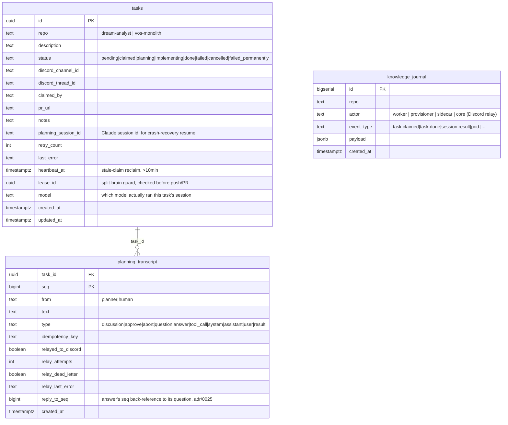

# ARCHITECTURE

Canonical topology and current features for `agent-fleet` — the WHAT. For
the WHY behind any specific choice, see [`DECISIONS.md`](DECISIONS.md) and
[`adr/`](adr/README.md). This revision reflects the
[`adr/0019`](adr/0019-shared-pvc-and-unified-provisioner.md)/
[`0020`](adr/0020-hub-and-spoke-grpc-worker-sidecar.md)/
[`0021`](adr/0021-continuous-streaming-session.md) redesign: `fleet-core` →
`core`, `e2e-provisioner` → `provisioner`, a new `sidecar` container, and a
rewritten single-shot `worker/`. It also folds in
[`adr/0022`](adr/0022-batch-job-worker-pod-lifecycle.md)–[`0025`](adr/0025-continuous-session-worker-redesign.md)
(the reliability backlog, `docs/reliability-findings.md`, PRs #25–#29):
worker pods run as `batch/v1.Job`, worktree/branch cleanup moved off
task-status-triggered deletion, pod crashes get a fast-path report, and
the worker's own fleet-orchestrated phase machinery is gone — one
continuous session is now uniformly relayed, gated only by the SDK's own
`canUseTool`. Where this disagrees with anything else, this file wins for
topology/features — the reading order is `DECISIONS.md` → this file →
`adr/` → source.

## 1. Components

| Component | Role |
|---|---|
| `core/` | Go service: Discord ingress (`/task`/`/approve`/`/stop`/`/e2e-kill`, legacy `!task repo: desc`) + the dispatch loop that claims pending tasks and commands the provisioner to spawn worker pods + `CoreService`, core's own gRPC server (agent-facing proxied MCP calls, wrapper-facing housekeeping calls, and the provisioner's pushed pod-lifecycle event stream) + planning-transcript coordination (Postgres) + Loki log/introspection queries + the web dashboard's ConnectRPC API and static SPA (`dashboard/`) — all as internal packages in one binary. **The fleet's sole holder of `AGENTFLEET_DB_*` credentials** (`docs/adr/0020` point 1) and the *only* component that ever calls the provisioner (hub-and-spoke). Needs zero cluster RBAC. |
| `provisioner/` | Go service (`client-go`) — the only component in the fleet with Kubernetes RBAC (namespaced `Role`, never a `ClusterRole`) to create/delete Pods/Jobs/Services/IngressRoutes/Middlewares. Owns **all** cluster-pod creation in the fleet: on-demand e2e-preview pods (bare `Pod`, unchanged behavior from `adr/0012` — long-running/interactive, killed explicitly, not run-to-completion) and worker sessions (a `batch/v1.Job` as of [`adr/0022`](adr/0022-batch-job-worker-pod-lifecycle.md) — `BackoffLimit: 0`, `TTLSecondsAfterFinished: 300s`; `core`'s heartbeat/reclaim stays the sole retry mechanism). Also owns the entire git lifecycle on the one shared workspace PVC — clone, fetch, worktree add (reuse-not-wipe) — serialized per-repo by an in-process mutex (`internal/git`), so no PVC-level file lock is needed. A worktree/branch is **never** deleted as part of session teardown anymore ([`adr/0023`](adr/0023-worktree-reuse-and-branch-sweep.md)) — cleanup is a separate periodic sweep (`internal/sweep`, `[gone]`-tracked branches only) plus a manual dashboard "Worktrees" view. Holds **zero** Postgres credentials; Kubernetes itself (pod/Job existence/phase) is its durable source of truth for session state. Hosts `ProvisionerService` (gRPC server, core is the only caller) and is a gRPC client of core, pushing `PodEvent`s — including a fast-path crash report the instant a worker `Job` reaches `Failed` ([`adr/0024`](adr/0024-crash-fast-path-and-journal-read.md)). |
| `sidecar/` | Go — new, a real second container in every worker pod (`docs/adr/0020` point 5). Two local (`localhost`-only) surfaces, one outbound gRPC connection to `core`: an MCP server the Agent SDK session connects to (proxies `send_message`/`wait_for_messages`/`AskUserQuestion`/`request_e2e_env`/`kill_env` onward to `CoreService`), and a plain HTTP/JSON API for the TS wrapper's own control-flow (`heartbeat`, `status`, `journal`, `session-id`, `still-holds-lease`, `telemetry`, `message`) — including the load-bearing `GET /human-messages` SSE feed that delivers new human input to the wrapper live, for `streamInput()` (`docs/adr/0021` point 2). An independent telemetry loop pushes `git diff --numstat`-derived branch/file-change stats to core every 5s, decoupled from anything the agent itself does. |
| `worker/` | The Claude Code worker (TS/Bun — the only remaining JS runtime in the fleet, sole host of `@anthropic-ai/claude-agent-sdk`'s `query()`). **Single-shot** (`docs/adr/0019`): the provisioner hands it one `TASK_ID`/`TARGET_REPO`/`LEASE_ID`/`BASE_BRANCH` via env, already pointed at a pre-cloned, pre-worktreed `/workspace` — the worker never runs `git clone`/`git worktree add` itself. Runs **one continuous `query()` session in streaming-input mode**, no fleet-imposed phase boundary of any kind — the agent paces its own explore/plan/implement work, gated only by `Write`/`Edit` being denied until an explicit `/approve` ([`adr/0025`](adr/0025-continuous-session-worker-redesign.md)). The agent runs its own `git commit`/`push`/`gh pr create` via Bash inside the session; the wrapper's remaining job is bootstrap, heartbeat, status reporting, and a post-session `verifyPrExists` (`gh pr list`) check before declaring done. Talks only to its own pod's `localhost` sidecar — never Postgres, never the provisioner, never `core` directly. |
| `proto/` | buf-managed `.proto` schema (lint + breaking-change CI + generate/drift check): `CoreService` (core's gRPC server — agent/wrapper/provisioner-facing), `ProvisionerService` (the provisioner's gRPC server, renamed from `E2eProvisionerService`), and `DashboardService` (ConnectRPC, dashboard ↔ core). Generates Go (`proto/gen/go`) and TS types (`worker/src/gen`, `dashboard/src/gen`, `ts-proto`). |
| `db/schema.sql` | Shared Postgres schema (`agentfleetdb`, Pigsty-managed), applied idempotently via `core migrate` (`go:embed`'d, `core`'s own `PreSync` hook — see `core/internal/db/migrate.go`). `tasks` (the queue — gains a `failed_permanently` terminal status as of [`adr/0024`](adr/0024-crash-fast-path-and-journal-read.md), a retry-cap outcome distinct from a single attempt's `failed`), append-only `knowledge_journal` (now readable via `GetJournal`, `adr/0024`), `planning_transcript` (durable planning transcript, pull/cursor reads, idempotency-keyed appends, plus a `reply_to_seq` column for question-seq correlation as of [`adr/0025`](adr/0025-continuous-session-worker-redesign.md)). `e2e_sessions` still exists in the schema but is **no longer read or written by any Go/TS code** — e2e-session state moved to being Kubernetes-native (pod existence/phase) as of `docs/adr/0020` point 1; see §6. |
| `dashboard/` | React + Vite + TypeScript + Tailwind/DaisyUI SPA — task list, **task creation** (`NewTaskDialog.tsx`, `DashboardService.CreateTask` — an alternative to Discord's `/task`, not a replacement), task detail (live transcript via a Connect server-streaming RPC, approve/stop/kill-e2e buttons, code-server link, `AskUserQuestion` answer forms — `adr/0018`), talking to `core` via a generated `@connectrpc/connect-web` client. Built into and served by `core`'s binary — not deployed on its own. Unaffected in substance by the `adr/0019`–`0021` redesign — only the backend's internal transport to the worker changed, not the dashboard-facing contract. |
| `k8s/` | This repo's own deploy manifests: `core.yaml` (Helm values for `common-app-chart`, zero RBAC) and `provisioner/` (a standalone plain-manifest directory — `Deployment`/`Service`/`ServiceAccount`/`Role`/`InfisicalSecret`/`NetworkPolicy`/`PersistentVolumeClaim` — since it needs RBAC `common-app-chart` can't express). Both referenced from `infra-bootstrap`'s `gitops/` (see §9). |
| `e2e-runner/` | One generic pod image (code-server + the target app + a Playwright MCP server, CPU-only headless Chromium for v1) the provisioner spins up per on-demand e2e request, parametrized by env vars the same way `worker/`'s image is parametrized by `TARGET_REPO`. Unchanged by this redesign. |

## 2. End-to-end flow

```mermaid
sequenceDiagram
    participant D as Discord
    participant C as core (Discord ingress, dispatch, CoreService gRPC)
    participant PG as Postgres (tasks + planning_transcript)
    participant P as provisioner (ProvisionerService gRPC, git, k8s)
    participant SC as sidecar (in worker pod)
    participant W as worker (TS wrapper, in worker pod)
    participant Ag as Agent SDK session (streaming-input)

    D->>C: /task repo desc
    C->>PG: CreateTask() → status=pending

    loop dispatch loop, every 2s (core/internal/dispatch)
        C->>PG: ClaimNextTask(maxInFlight, maxRetries) (FOR UPDATE SKIP LOCKED — headroom + retry-cap check folded into the one query)
    end
    C->>P: CreateWorkerPod(taskId, repo, repoUrl, baseBranch, leaseId) [gRPC]
    P->>P: EnsureRepoCloned / CreateWorktree (reuse-not-wipe, per-repo in-process mutex)
    P->>SC: client-go creates a batch/v1.Job, two containers: worker + sidecar (adr/0022)
    P-->>C: ReportPodEvents stream (created→scheduled→running→...→[fast-path Failed], adr/0024) [gRPC]
    C->>PG: journal every pod event (knowledge_journal)

    W->>Ag: query() streaming-input, one taskPrompt, no fleet-imposed phase boundary
    Ag->>SC: mcp tool call (local MCP, e.g. send_message)
    SC->>C: SendMessage [gRPC]
    C->>PG: Append to planning_transcript
    C-->>D: relay loop posts every message live (allowlisted types only, adr/0025 pt.5)

    D->>C: thread reply
    C->>PG: Append (from=human)
    C-->>SC: StreamHumanMessages [gRPC server-stream]
    SC-->>W: GET /human-messages (SSE)
    W->>Ag: streamInput(reply text)

    D->>C: /approve (structured signal only — adr/0025 pt.3)
    C-->>SC: StreamHumanMessages delivers the approve entry
    SC-->>W: SSE event, type=approve
    W->>Ag: query.setPermissionMode('default') — no new prompt pushed
    Note over Ag: same session, same taskPrompt, no restart — canUseTool now allows Write/Edit

    Ag->>Ag: write code, tests, docs; commit, push, gh pr create — all via Bash, in-session
    W->>W: verifyPrExists(): gh pr list --head <branch> (post-session check, not trusted from the agent's own claim)
    W->>SC: POST /status {done, prUrl} → SetTaskStatus [gRPC]
    SC->>C: SetTaskStatus [gRPC]
    C->>PG: tasks.status=done, pr_url set
    C->>P: TearDownSession(taskId, WORKER) [gRPC] — opportunistic, on any terminal status
    P->>P: delete Job (worktree/branch untouched — reuse + periodic sweep, adr/0023)
    C-->>D: relay posts summary + PR link
```

`/stop` (or "stop"/"abort"/"cancel"/"kill" in a reply) maps to
`query.interrupt()` — the SDK's own graceful stop primitive, not a process
kill — plus `abortController.abort()` as a backstop for the case where the
session is idle and there's nothing active to interrupt (`docs/adr/0021`
point 3). This is a structured signal only (`/stop`, or the same handful of
literal Discord replies) — there is no free-text sentiment matching, and it
can fire at any point in the one continuous session, not just a specific
phase (`adr/0025` pt.3).

Every `AskUserQuestion` carries the transcript's own append-order sequence
number; the human's reply threads back via a `reply_to_seq` column
(`planning_transcript`), so a second question posted before the first is
answered can't have its reply misattributed — a real gap under
concurrent/rapid questions, not a hypothetical one (`adr/0025` pt.4). Both
Discord and the dashboard can answer a question now; previously only the
dashboard could (superseding `adr/0018`'s dashboard-only framing).

During implementation, the agent can call `request_e2e_env`/`kill_env` — a
three-hop proxy (agent → sidecar's local MCP → `core`'s `CoreService` →
`provisioner`'s `ProvisionerService`) to spin up a live preview pod and
drive Playwright browser tests against it, per `docs/adr/0012`'s original
design (RBAC boundary unchanged) as extended by `docs/adr/0020`'s
hub-and-spoke rule (no direct worker→provisioner path exists anymore, even
for this). Teardown happens on the task reaching a terminal status
(`core`'s opportunistic trigger in `SetTaskStatus`) or an explicit kill
(`/e2e-kill` from Discord, or the agent's own `kill_env`) — never merely
because a PR was opened.

**MCP is purely local** (agent ↔ its own pod's sidecar, over `localhost`).
**gRPC is the only inter-process/inter-pod protocol anywhere in the
fleet** — there is no direct HTTP MCP surface reachable across a pod
boundary anymore (`docs/adr/0020` point 6).

## 3. Planning-phase guardrails

- **Complexity-gated interview/doubt, no `/task` knob.** The planner
  decides for itself, per task, whether `architecture-interview` and/or
  `doubt-driven-development` apply, using each skill's own "when to use"
  criteria. Mohammad can still interject live in the thread at any point
  ("skip the interview" / "run doubt on this") — narrative planning
  discussion is fed straight into the running session via `streamInput()`
  (`docs/adr/0021`), reaching the model live instead of waiting for it to
  poll — see [`adr/0017`](adr/0017-single-session-planning-pipeline.md).
- **No round cap, no phase boundary — the agent paces itself.** The old
  `PLAN_READY:`/`PR_READY:` message-prefix parsing and the round-cap/
  checkpoint machinery built on top of it are deleted outright: there's no
  fleet-imposed phase transition left to checkpoint on. One `taskPrompt`
  spans the whole session; the agent decides when to explore, when to plan
  out loud, and when to implement, ending its final message with a
  `PR_READY:` summary line the wrapper uses for the PR description only —
  not as a phase signal (`adr/0025` pt.1–2).
- **AskUserQuestion, correlated by sequence and answerable from Discord or
  the dashboard.** A real `AskUserQuestion` MCP tool (proxied through the
  sidecar → `core`) posts a `question`-type `planning_transcript` entry and
  long-polls until a matching `answer` entry appears, threaded via a
  `reply_to_seq` column so a second question posted before the first is
  answered can't have its reply misattributed. Superseded from `adr/0018`:
  Discord can now answer questions too, not just the dashboard (`adr/0025`
  pt.4).
- **`/approve` is a live `query.setPermissionMode()` call**, made by the
  wrapper the instant a *structured* approval signal arrives — `/approve`,
  or the same handful of literal Discord replies already treated as
  structured. The old free-text `isApproval()`/`isAbort()` word-match regex
  is deleted: it produced real false positives ("I don't approve this,
  redo the auth flow" used to match). No new process, no session teardown
  — `docs/adr/0005`'s "never inferred from silence or sentiment" rule is
  unchanged, only the trigger mechanism changed (`adr/0025` pt.3).
- **Two independent enforcement layers on `Write`/`Edit`, confirmed by real
  testing, not assumed — unchanged by this redesign.** `Write`/`Edit` stay
  structurally absent from `allowedTools` for the whole session; a
  `canUseTool` callback additionally denies them while an in-memory
  `approved` flag is false. Verified empirically (`docs/adr/0021`'s
  original spike, reconfirmed by a 3-minute pending-decision spike for
  `adr/0025`): with `Write` *in* `allowedTools`, `canUseTool` is never
  invoked at all — the list bypasses the callback entirely, which is
  exactly why the tool stays undeclared.
- **Every raw SDK message is relayed to Discord through an allowlist, not
  a denylist.** `logSdkMessage` now relays every SDK message type;
  `relay.go`'s `discordSafeTypes` allowlist decides what actually reaches
  the thread. A denylist would let any new raw SDK message type leak by
  default — a real secret-leak risk (Bash stdout/stderr, file contents)
  (`adr/0025` pt.5).
- **Turn/time limits are opt-in, not default.** `MAX_TURNS` aside, nothing
  else is bounded unless explicitly set — see
  [`adr/0008`](adr/0008-unbounded-guardrail-defaults.md). `MAX_PLANNING_ROUNDS`
  no longer exists — there's no round concept left to cap.
- **No cost cap.** Claude Code authenticates via `CLAUDE_CODE_OAUTH_TOKEN`
  (subscription), not a metered API key, so `total_cost_usd` in SDK
  results is notional, not a real charge.
- Every SDK message (not just the final result) is logged
  (`worker/src/planning.ts`'s `logSdkMessage`), and every assistant text
  block is relayed into the transcript (`sidecar.pushMessage`) — added
  after a real incident where a missing `allowedTools` entry silently
  denied every MCP tool call with zero visible signal until cost/turn-count
  was inspected after the fact.

## 4. Current features (the golden path, working today)

- `/task`, `/approve`, `/stop`, `/e2e-kill` Discord slash commands,
  guild-scoped (registers instantly, no global-command propagation delay).
- Legacy fallback: free-text `!task <repo>: <description>` trigger and
  plain "approved"/"stop" replies.
- **Tasks can also be created from the dashboard, not just Discord** —
  `DashboardService.CreateTask` calls the exact same `tasks.Store.CreateTask`
  path the Discord `/task` handler does, just with a nil
  `discord_channel_id`/`discord_thread_id` (that column is nullable as of
  this feature). No separate task-creation logic to keep in sync: a
  dashboard-created task has no Discord thread at all, and
  `core/internal/discord/session.go`'s `PostToThread` already no-ops when
  `ThreadID` is nil, so relay/approve/stop all work identically regardless
  of which surface created the task — approval/stop for a dashboard-only
  task just has to happen from the dashboard instead of a Discord reply,
  since there's no thread to reply in.
- Live relay of every message on the planning transcript — plan drafts,
  interview questions, doubt-cycle status, raw assistant narration — to
  the Discord thread as it's generated, via `core`'s own relay loop
  (`internal/transcript/relay.go`), regardless of whether the message came
  from the agent's own `send_message` tool call or the sidecar's
  independent telemetry/wrapper housekeeping calls.
- Structured self-review via real, vendored Claude Code skills
  (`doubt-driven-development`'s fresh-context `Task`-tool subagent,
  `architecture-interview`'s stakeholder elicitation) — see
  [`adr/0017`](adr/0017-single-session-planning-pipeline.md).
- **One continuous Agent SDK session per task**, streaming-input mode, one
  `taskPrompt`, no fleet-imposed phase boundary between planning and
  implementation — no restart, no context loss, no disk-based resume at
  the approval boundary (`resume: sessionId` is kept only for crash
  recovery, `docs/adr/0016`/`0021` point 6, `adr/0025`).
- Explicit-approval gate: write/edit tools structurally absent from
  `allowedTools` for the whole session, plus a live `canUseTool` backstop
  — see §3.
- `/e2e-kill` requests a kill via `core`'s `CoreService.KillE2eEnv`, proxied
  to the provisioner's `ProvisionerService.KillE2ESession` — `core` never
  writes e2e-session state directly, and e2e-session state itself is
  Kubernetes-native now (§6), not a Postgres row.
- Git commit identity derived live from the authenticated bot GitHub
  account (`gh api user --jq .login`), not hardcoded — both the
  provisioner (its own clone/fetch) and the worker (its own push/PR) do
  this independently, since the two processes don't share `$HOME`.
- Append-only `knowledge_journal` — task lifecycle events, session
  results, and provisioner pod-lifecycle events, all funneled through
  `core`'s single Postgres connection, now readable via a typed
  `GetJournal` RPC instead of direct-SQL-only (`adr/0024`).
- **Worktree reuse, not wipe, plus a periodic sweep.** `CreateWorktree`
  returns immediately if the task's worktree path already exists — no git
  command runs on a retry. Worktree/branch deletion is never a side effect
  of session teardown or task status anymore; cleanup is a separate
  periodic sweep (`provisioner/internal/sweep`, `git fetch --prune` +
  `[gone]`-ref detection) plus a manual "Worktrees" dashboard view for
  anything the sweep can't reach (e.g. a branch never pushed)
  (`adr/0023`).
- On-demand e2e test environments during implementation, three-hop
  proxied through `core` (§2) — see
  [`adr/0012`](adr/0012-e2e-provisioner-standalone-app.md). CPU-only for
  now; GPU-accelerated Chromium is a deferred fast-follow.
- **Fleet-wide concurrency, not one task per repo.** Any number of tasks
  across any known repo can be in flight simultaneously, up to
  `MAX_IN_FLIGHT_TASKS` (default 5) — `core`'s dispatch loop claims
  repo-agnostically (`docs/adr/0019`).
- **Crash recovery with a fast path, not just a 10-minute wait.** Worker
  sessions are single-shot `batch/v1.Job`s; the instant a `Job` reaches
  `Failed`, the provisioner's `EventReporter` pushes a crash event that
  `core` turns into `tasks.MarkCrashed` — backdating `heartbeat_at` so the
  *next* dispatch tick reclaims it immediately, not after the old
  10-minute stale-heartbeat wait. That heartbeat reclaim is kept as the
  fallback for a missed push event, not replaced. `ClaimNextTask` also
  gets a `maxRetries` cap (`MAX_TASK_RETRIES`, default 3) — a reclaim at
  the cap sets `failed_permanently` instead of retrying again
  (`adr/0024`). The provisioner's reconcile loop still garbage-collects
  the `Job` itself if it reached a terminal k8s phase without `core` ever
  calling `TearDownSession` for it.

## 5. Deployment shape

**One shared `ReadWriteMany` PVC** (`agent-fleet-workspace`, owned by the
provisioner's own manifests) replaces the old two per-repo workspace PVCs
(`docs/adr/0019`). Layout: `<root>/repos/<repo>/` (one clone per repo,
fetched in place, never re-cloned per task) and
`<root>/worktrees/<taskId>/` (one worktree per task, keyed by the
already-globally-unique task ID, not nested per repo). Only the
provisioner (clone/fetch/worktree add, reuse-not-wipe, `adr/0023`) and each
task's worker+sidecar pod ever touch it — `core` holds zero PVC access,
matching its zero-RBAC design. The old
`agent-fleet-shared-pvc` (`/mnt/fleet-shared`, skills/journal-mirror/MCP
configs) is dropped entirely — confirmed via a full-repo grep that nothing
in `core`/`provisioner`/`sidecar`/`worker` references it anymore; the
planning skills plugin now ships baked into the worker image
(`PLANNING_SKILLS_PLUGIN_PATH = "/app/worker/skills/agent-fleet-planning"`,
unchanged from before this redesign — the PVC-resident-skills idea from
`docs/adr/0019` point 6 was not carried into the actual implementation).

**Worker sessions are single-shot, two containers, spawned per task — not
persistent, not one Deployment per repo.** The provisioner builds a
`batch/v1.Job` directly via `client-go` (`provisioner/internal/k8s/pod.go`,
`adr/0022`) for worker sessions; on-demand e2e-preview sessions stay a bare
`Pod` (long-running/interactive, killed explicitly rather than run-to-
completion — `Job` semantics don't fit):
- `worker` container: the TS/Bun image, `TASK_ID`/`TARGET_REPO`/
  `TASK_DESCRIPTION`/`LEASE_ID`/`BASE_BRANCH`/`SIDECAR_MCP_ADDR`/
  `SIDECAR_API_ADDR`/`GH_TOKEN`/`WORKTREE_PATH` env, `250m`–`2000m` CPU /
  `512Mi`–`2Gi` memory.
- `sidecar` container: the Go image, `TASK_ID`/`TARGET_REPO`/`MCP_PORT`
  (9090)/`LOCAL_API_PORT` (9091)/`WORKTREE_PATH` env, `50m`–`250m` CPU /
  `64Mi`–`256Mi` memory.
- Both mount the **whole** PVC at `/workspace` — not a per-task `subPath`.
  A linked git worktree's `.git` file is an absolute-path gitlink back to
  `repos/<repo>/.git/worktrees/<taskId>` (`HEAD`/`index`/`commondir`); a
  `subPath` scoped to just `worktrees/<taskId>` cuts that path off, so
  every git command in the pod fails with "not a git repository" (found
  live, 2026-08-05, fixed in PR #30). `WORKTREE_PATH` (the provisioner's
  own `CreateWorktree` result, e.g. `/workspace/worktrees/<taskId>`) tells
  worker/sidecar where their task's checkout lives within that shared
  view; isolation between concurrent tasks' worktrees is by directory
  naming (keyed by task ID) only, not a mount boundary.
- `RestartPolicy: Never` on the Job's pod template — a crashed pod is not
  restarted by Kubernetes; recovery is `core`'s crash fast-path/stale-
  heartbeat reclaim (§4), not `kubelet` or the Job's own (deliberately
  disabled, `BackoffLimit: 0`) retry.

**`core` needs zero cluster RBAC**, so it deploys via this repo's own
`k8s/core.yaml` through `common-app-chart` (two-source ArgoCD Application,
chart from `infra-bootstrap`, values from here) — no standalone-Application
escape hatch needed. `core` is this repo's first app with a real listening
`service.port` (`8080`, publicly reachable — the dashboard/`/healthz`) and
a second, `ClusterIP`-only gRPC port (`CORE_GRPC_PORT`, `9090`, never
publicly routed). Its HTTP ingress is gated behind the shared
`basic-admin-auth` Traefik Middleware (already gating pgweb/Alertmanager).

**`provisioner` needs real RBAC**, so — unlike `core` — it is **not**
deployed through `common-app-chart`. As of this redesign its manifests
moved *into this repo* (`k8s/provisioner/`: `Deployment`, `Service`,
`ServiceAccount`, namespaced `Role`, `InfisicalSecret`, `NetworkPolicy`,
`PersistentVolumeClaim`), registered in `infra-bootstrap` as a standalone
plain-manifest ArgoCD Application (`gitops/bootstrap/
provisioner-application.yaml`) pointed at this repo instead of
`infra-bootstrap/gitops/platform/e2e-provisioner/` (the old location, now
deleted) — see §9. Its `Role` (`k8s/provisioner/role.yaml`) grants
`batch/jobs` alongside `pods`/`services`/`ingressroutes`/`middlewares` as
of `adr/0022` — a gap the fake-clientset unit tests didn't catch, only a
real `kind`-cluster smoke test did.

### Deploy pipeline

1. Push a tag → `.github/workflows/docker.yml`'s `build-push` job builds
   the `worker` image (Bun-based); `build-push-go` builds `core`/
   `provisioner`/`sidecar` (Go, no `package.json` — tagged with the pushed
   git tag directly). A separate `.github/workflows/go.yml` runs the real
   correctness gate for the Go side on every push/PR: `go vet`,
   `golangci-lint`, `go test -race`, `-tags=integration` tests against a
   real Postgres service container, plus `buf lint`/`buf breaking`/a
   generate-drift check for `proto/`.
2. `docker.yml`'s `deploy` job (needs all build jobs) `sed`-bumps every
   `tag: "..."` in `k8s/core.yaml` (Helm-values shape) and every
   `image: repo:tag` in `k8s/provisioner/*.yaml` (plain-manifest shape,
   scoped to `mohammaddocker/agent-fleet-{core,provisioner,worker,sidecar}`
   — `e2e-runner`'s floating `:latest` is deliberately excluded) to the
   pushed tag, and commits straight to `main` (via the default
   `GITHUB_TOKEN`, deliberately not re-triggering `release.yml`'s
   push-to-main trigger).
3. ArgoCD's Applications (`core` via a two-source chart Application,
   `provisioner` via its own standalone plain-manifest Application) pick up
   the new pinned tags and sync.
4. `db/schema.sql` is applied idempotently via a `PreSync` hook on `core`'s
   Application, running `core migrate` (schema `go:embed`'d into the
   binary at build time).

`release.yml` runs separately (`release-it`, conventional-changelog/
angular preset) on ordinary pushes to `main`, bumping `package.json`'s
version and `CHANGELOG.md` — unrelated to the image-tag bump above; the
whole fleet (`core`/`provisioner`/`sidecar`/`worker`/`e2e-runner` images)
still ships as one version/CHANGELOG, one repo.

## 6. Data model



`tasks` is the mutable queue; `knowledge_journal` is append-only, written
only by `core` now (every writer — worker, sidecar, provisioner — goes
through `core`'s `CoreService.AppendJournal`/`ReportPodEvents`, since
`core` is the fleet's sole Postgres-credential holder). `planning_transcript`
gives the same append-once-per-call ordering guarantee a durable list
would, plus real dedup via the `(task_id, idempotency_key)` unique index;
the `relay_*` columns are a retry/DLQ for the Discord-posting side effect
only, not the transcript entry's own durability. The `tool_call` transcript
type carries the sidecar's independent telemetry (git diff/branch stats) —
`internal/transcript/relay.go`'s `relayPending` skips this type, so it
never posts to Discord.

**`e2e_sessions` still exists in `db/schema.sql` (and the `core`-embedded
copy) but is dead code as of this redesign** — a full grep across
`core/`, `provisioner/`, and `worker/` finds zero reads or writes against
it. E2e-session existence/status is derived live from Kubernetes pod
state instead (`provisioner/internal/grpcserver`'s `GetE2ESessionStatus`/
`CreateE2ESession` call `k8sc.GetPod`, never a Postgres query) —
`docs/adr/0020` point 1's "the provisioner holds no DB credentials at all"
made the table's original purpose (the one coordination point between
worker tool calls, the provisioner's reconcile loop, and `/e2e-kill`)
moot. Left in the schema rather than dropped as part of this doc-only
pass; dropping it is a small, separate follow-up if anyone confirms
nothing external still queries it directly.

## 7. Environment variables

### `core/`

| Var | Default | Notes |
|---|---|---|
| `CORE_PORT` | `8080` | HTTP: `/healthz`, dashboard ConnectRPC API, static SPA |
| `CORE_GRPC_PORT` | `9090` | `CoreService` — the provisioner's `ReportPodEvents` client and every worker pod's sidecar connect here |
| `AGENTFLEET_DB_HOST`/`PORT`/`NAME`/`USER`/`PASSWORD` | `postgres.bnei.lan`/`5432`/`agentfleetdb`/`dbuser_agentfleet`/– | the *only* component in the fleet with these |
| `DISCORD_BOT_TOKEN` | – | |
| `DISCORD_TRIGGER_CHANNEL_ID` | – | |
| `LOKI_URL` | `http://loki.monitoring.svc.cluster.local:3100` | log/introspection queries |
| `PROVISIONER_GRPC_ADDR` | `provisioner.agent-fleet.svc.cluster.local:9090` | `ProvisionerService` client target |
| `MAX_IN_FLIGHT_TASKS` | `5` | dispatch loop's fleet-wide concurrency cap (`docs/adr/0019`/`0020`) |
| `MAX_TASK_RETRIES` | `3` | `ClaimNextTask`'s reclaim cap — a reclaim past this sets `failed_permanently` instead of retrying (`adr/0024`) |

### `provisioner/`

| Var | Default | Notes |
|---|---|---|
| `NAMESPACE` | `agent-fleet` | where it creates/deletes Pods/Services/IngressRoutes/Middlewares |
| `E2E_RUNNER_IMAGE` | `mohammaddocker/agent-fleet-e2e-runner:latest` | floating tag for v1 |
| `WORKER_IMAGE` | `mohammaddocker/agent-fleet-worker:latest` | pinned by the deploy job in practice |
| `SIDECAR_IMAGE` | `mohammaddocker/agent-fleet-sidecar:latest` | pinned by the deploy job in practice |
| `WORKSPACE_PVC` | `agent-fleet-workspace` | the one shared RWX PVC name |
| `WORKTREES_ROOT` | `/workspace` | where that PVC is mounted inside the provisioner's own pod |
| `E2E_HOST` | `e2e.bnei.dev` | static host, path-routed per task |
| `E2E_START_CMD_DREAM_ANALYST`, `E2E_START_CMD_VOS_MONOLITH` | `bun install && bun run dev` | per-repo build/run command |
| `PORT` | `8080` | HTTP (currently unused beyond health, kept for parity) |
| `GRPC_PORT` | `9090` | `ProvisionerService` |
| `CORE_GRPC_ADDR` | `core.agent-fleet.svc.cluster.local:9090` | where `ReportPodEvents` streams to |
| `RECONCILE_INTERVAL_MS` | `10000` | terminal-worker-pod GC poll (`internal/reconcile`) |
| `GH_TOKEN` | – | for the provisioner's own clone/fetch auth (`gh auth setup-git`), and forwarded verbatim into every worker pod's `worker` container env |

No `AGENTFLEET_DB_*` here at all — see §6.

### `sidecar/` (per worker pod, injected by the provisioner at pod creation)

| Var | Default | Notes |
|---|---|---|
| `TASK_ID` | *(required)* | |
| `TARGET_REPO` | – | |
| `CORE_GRPC_ADDR` | `core.agent-fleet.svc.cluster.local:9090` | its one outbound gRPC connection |
| `WORKTREE_PATH` | `/workspace` | for the telemetry loop's `git diff`/`rev-parse` calls |
| `MCP_PORT` | `9090` | agent-facing local MCP server |
| `LOCAL_API_PORT` | `9091` | wrapper-facing plain HTTP/JSON API |

### `worker/` (per worker pod, injected by the provisioner at pod creation)

| Var | Default | Notes |
|---|---|---|
| `TASK_ID`, `TARGET_REPO`, `LEASE_ID` | *(required)* | |
| `TASK_DESCRIPTION` | – | |
| `BASE_BRANCH` | `main` | e.g. `dev` for `vos-monolith` |
| `SIDECAR_MCP_ADDR` | `localhost:9090` | the Agent SDK session's `mcpServers` config points here |
| `SIDECAR_API_ADDR` | `localhost:9091` | the wrapper's own control-flow calls |
| `WORKTREE_PATH` | `/workspace` | |
| `GH_TOKEN` | – | the worker's *own* `git push`/`gh pr create` auth — separate from the provisioner's, since the two are different pods that don't share `$HOME` |
| `CLAUDE_MODEL` | `claude-opus-4-8` | |
| `MAX_TURNS` | unbounded | opt-in cap |
| `CLAUDE_CODE_OAUTH_TOKEN` | – | minted via `claude setup-token` |

All of the above flow through Infisical (project `agent-fleet-nygh`,
env `dev`) — never committed, never in a manifest as plain text.

## 8. Current targets

`dream-analyst` and `vos-monolith` — real repos. `core/internal/tasks`'
`KnownRepos` map (moved from `bot/src/db.ts`'s `KNOWN_REPOS`, then from
`fleet-core`) is the source of truth for which repos the `/task` command
accepts and their per-repo `RepoConfig` (clone URL, base branch). No
per-repo Deployment or PVC exists anymore — onboarding a new repo is
purely a `KnownRepos` entry, not new k8s manifests (`docs/adr/0019`'s
stated goal).

## 9. Relationship to `infra-bootstrap`

- The cluster (`ukubi-cluster`), GitOps (`gitops/`), and secrets backend
  are all owned by `infra-bootstrap` — this repo consumes them, it doesn't
  redefine them.
- Only the Application/ApplicationSet registration lives in
  `infra-bootstrap`'s `gitops/apps/registry.yaml` +
  `gitops/bootstrap/apps.applicationset.yaml` (the latter is the literal
  generator ArgoCD reads; the former is a human-maintained mirror — both
  must be kept in sync manually) — see that repo's `/add-app` skill and
  `gitops/README.md`.
- `core` deploys via this repo's own `k8s/core.yaml` (`common-app-chart`,
  registered in `infra-bootstrap` like any other app) since it needs no
  RBAC `infra-bootstrap` would otherwise have to grant. The ArgoCD
  Application is named `agent-fleet-core` (renamed from `agent-fleet-bot`
  once nothing PVC-stateful was attached to it anymore).
- `provisioner`'s manifests **moved from `infra-bootstrap` into this
  repo** (`k8s/provisioner/`) as part of this redesign — it's still a
  standalone plain-manifest ArgoCD Application (`platform-provisioner` in
  `infra-bootstrap`'s `gitops/bootstrap/provisioner-application.yaml`,
  since it needs RBAC `common-app-chart` can't express), but the
  manifests themselves are no longer `infra-bootstrap`'s to edit.
- This fleet does **not** manage `infra-bootstrap`'s own cluster ops
  (kubespray/ansible/pigsty) — blocked per that repo's own `CLAUDE.md`.
