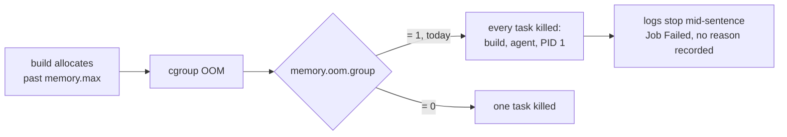

# ADR-0054 — The toolchain stays in the pod; an OOM gets a name instead of a machine

**Status:** Accepted
**Date:** 2026-08-18
**Related:** `0048` §6 (there is no sandbox), `0051` (the shared PVC as a
no-rebuild channel), `0053` (the gate is `canUseTool`).
**Rejects:** moving the worker's toolchain and heavy compute into a
separately-owned Proxmox LXC.

## Context

The proposal: keep the Claude Agent SDK session inside the ephemeral worker
pod, but move the container holding the binaries and the build/test compute
into an LXC owned separately from the cluster. Stated goals — a smaller
cluster workload, a faster session start, and processing power plus toolchain
owned outside Kubernetes.

An architecture interview plus a live infrastructure survey of ukubi-cluster
turned that into two independent problems that happen to share one
attractive-looking solution. Neither is what the goals said it was.

### Finding 1 — the agent and the build share one cgroup

Measured from inside a running worker pod on 2026-08-18:

| | value |
|---|---|
| `memory.max` | `4294967296` (4 GiB) |
| `memory.oom.group` | **`1`** |
| `memory.current` | `449593344` — the agent alone, 0.45 GB |
| `memory.peak` | `492924928` — the whole session |
| `cpu.max` | `400000 100000` (4 CPU) |
| `memory.high` | `max` (unset) |
| `cgroup.subtree_control` | *(empty)* |
| `/sys/fs/cgroup` mount | `cgroup2 (ro,nosuid,nodev,noexec)` |
| `echo 1 > memory.high` | `Read-only file system` |
| `mkdir /sys/fs/cgroup/x` | `Read-only file system` |

What follows from those ten lines:

1. `memory.oom.group=1` is a confirmed fact, not folklore. An OOM SIGKILLs
   **every task in the container** — the agent and PID 1 with it. There is no
   failed tool call, no error line, no `session failed`: the logs stop
   mid-sentence and the Job goes `Failed`.
2. The agent costs **0.45 GB**. It is never the greedy process. It is the
   collateral.
3. **No limit value fixes this.** 4 GiB, 16 GiB and 64 GiB all fail the same
   way, later. Raising the ceiling moves the wall; it does not add one.
4. **A child cgroup cannot be created from inside the container.** The cgroup2
   mount is read-only, `subtree_control` is empty, nothing is delegated —
   verified by attempting both a write and a `mkdir`.
5. **Linux has no per-process RSS limit.** `ulimit -v` bounds virtual address
   space; Go reserves large arenas up front, so it kills Go builds
   unpredictably. RSS is a cgroup-only concept.
6. Therefore **the only unit that owns a cgroup is a container.** A real
   containment boundary means a second container, a second pod, or a second
   machine. Nothing smaller exists.

That last box, not the kill itself, is the reported pain: "OOM killed a bunch
of pods" is a description of an absence.

### Finding 2 — the rebuild cycle is a separate problem

Changing a toolchain means editing a Dockerfile, building an image, pushing to
zot and redeploying. `repos.image` removed the *fleet release* from that loop
(`0048` §6 amendment) but not the *image build*.

The obvious shortcut was already tried and deleted here: `go-toolchain`,
`bun-toolchain`, `golangci-lint` and `buf` were catalog ingredients staged onto
an emptyDir `/opt/tools` by init containers, removed by `0048` §6 — "an init
container copying a Go toolchain onto an emptyDir is an elaborate way of saying
this repo needs Go". `cluster-access` survives because it is a privilege grant,
not a toolchain. It should not be re-proposed without reading why it died:
`go-toolchain` put `/opt/tools/go/bin` first on `PATH` and silently shadowed
the image's own Go, at a different patch version, with no error anywhere.

What did survive is the other shape — big toolchain bits on the shared PVC
rather than in the image. `0051` moved the Playwright browsers to
`/ms-playwright` and cut the image from 5.13 GB to 2.41 GB. The mount, the
populating Job, the failure handling and the ADR all exist already.

### What the infrastructure survey found about the LXC

Gathered live from the infra-bootstrap side, not assumed:

- **No pod-to-LXC command-execution channel exists, and no credential for
  one.** Worker pods have no SSH client and no keys; `build-runner`'s key is
  not in Infisical, only on the operator's laptop.
- **Both obvious ways to build one are closed by accepted ADRs.** A VPN mesh is
  rejected (infra ADR-0009, enforced by a `mission-drift` skill that greps for
  those strings) and Infisical-as-an-SSH-CA is rejected (infra ADR-0006).
  Proxmox-out-of-GitOps is a third (infra ADR-0012): human-run Terraform with
  `-target`, local state, one hand-written `.tf` per LXC, no on-demand
  creation, no clone-from-template, and no ZFS on any host to make cloning
  cheap.
- **The `mount` and `fuse` container features are `root@pam`-only** and
  unreachable from Terraform's API token, so an LXC that mounts NFS is
  permanent out-of-band drift.
- **Proxmox has less headroom than the cluster.** server1, which hosts
  `build-runner`, is at 28 GB of 31 GB; the other host is at 27 GB of 31 GB.
  The only machine with real RAM headroom is a two-core laptop that policy
  already marks best-effort-only.
- **Isolation would get worse.** `build-runner` runs buildah as root via sudo
  inside an unprivileged container; arbitrary execution there means any session
  can read or destroy any other session's work — against today's one pod, one
  PVC, one cgroup per session.
- **Observability and backup would go to zero.** No LXC is scraped by
  Prometheus or shipped to Loki, and `build-runner` is explicitly "no backup,
  by design".

It is also the topology `0048` §6 deleted. That proxy chain was roughly 2.5–3k
hand-written lines and took three consecutive repair ADRs; `0045` measured the
hop it removed at **0 ms**, so that design never had a latency problem — it had
a coupling problem.

## Decision

**The toolchain stays in the worker pod. The LXC is rejected. An OOM gets a
name instead of a machine.**

Four steps, cheapest first, to be taken only as far as the pain requires:

1. **Make the OOM legible.** `TTLSecondsAfterFinished` is now set and the
   reconcile pass no longer eagerly deletes terminal Jobs, so the corpse
   survives long enough to read — but nothing yet reads the worker pod's
   `State.Terminated.Reason`. When a worker terminated `OOMKilled`, write a
   transcript entry saying so and naming the limit it hit. The resume path
   already exists. An OOM stops being a disappearance and becomes a legible,
   resumable event. This is the highest value-per-line change available.
2. **Reduce the frequency.** `GOMEMLIMIT`, `NODE_OPTIONS=--max-old-space-size`
   and Bun's equivalent, set below the container limit so the runtimes reclaim
   instead of climbing into the wall. This lowers probability and contains
   nothing — an overshoot still kills the agent. It is worth doing because it
   is nearly free, and it must not be described as a fix.
3. **Attack the rebuild cycle with the pattern that already works.** A
   per-repo writable tools directory from the shared PVC, using the same
   subPath idiom as `claude-home/<sessionID>` and `/ms-playwright`, appended to
   `PATH`. The agent installs what it needs once and it is there next session,
   with no image build. This is deliberately not the deleted catalog
   mechanism: no fleet-declared ingredient, no provisioner code per tool, no
   `CopyImage` — just a directory the agent owns.
4. **Only if 1–3 fall short: a second container in the same pod.** Its own
   memory limit, its own cgroup, so its OOM kills only itself; the same image
   (one pull, node-cached, shared layers), the same session PVC, the same
   `/workspace` and `/cache`.

## Consequences

- Builds stay in-cluster and stay heavy. An OOM stays possible until step 4 —
  but stops being silent at step 1, which is what was actually being reported.
- The fleet keeps what the LXC would have cost it: per-session cgroup and PVC
  isolation, Prometheus metrics, Loki logs, Longhorn backups, RBAC, and a
  reconcile loop that compares against Kubernetes every 60s. Nothing reconciles
  an LXC.
- No new long-lived credential, no Proxmox state outside Terraform, and no
  second machine in the critical path of every `Bash`.
- Step 3 trades reproducibility for agility, and the trade must stay visible: an
  image is CI-verified and reproducible; a mutable tools directory drifts and
  has no provenance. Scoping it per repo keeps one repo's drift out of
  another's. **`PATH` order is the known landmine** — the tools directory ahead
  of the image's own toolchain re-creates exactly the bug that killed
  `go-toolchain`, so the existing `PATH`-shape guard must be extended rather
  than trusted.
- Step 4, if reached, is `run_command` returning, and should be budgeted as
  such. What makes it defensible is that all seven recorded failure modes of
  the deleted chain were *cross-pod* lifecycle problems — Service readiness
  gating, a target outliving or predeceasing the session, the endpoint roster,
  the proxy through core and the provisioner, a ~65s retry ladder for a pod
  that was not up yet. Inside one pod none of those exist. It still owes an
  answer for what `canUseTool` means when a command's blast radius is a sibling
  container, since `0053` assumes local.
- Steps 1–3 are two-way doors. Step 4 is closer to one-way: it changes what a
  `Bash` means. The rejected proposal was firmly one-way, which is why it was
  interviewed rather than tried.
- **The one LXC shape this infrastructure does support** is the Garage S3
  pattern: the LXC exposes a narrow authenticated network service and the pod
  calls it, with a scoped, rotatable, per-consumer credential from Infisical.
  That is a paved road, and worth remembering if one specific heavy capability
  ever needs offloading. It is a service, not shell access, so it does not fit
  "run the agent's arbitrary `Bash` somewhere else".

### Noticed while surveying, not part of this decision

Every fleet pod observed sits on `k8s-worker-01` (CPU requests 4063m of 5400m —
room for roughly one more concurrent session) while `k8s-worker-02` has about
2589m free. `SESSION_NODE_SELECTOR` is `agent-fleet.dev/session-node=true` and
that label is on **both** workers, so the concentration is not the selector.
Whatever the cause, spreading sessions would roughly double concurrency, and it
has nothing to do with where the toolchain lives. Worth one read-only look
before anyone concludes the cluster is out of room.
